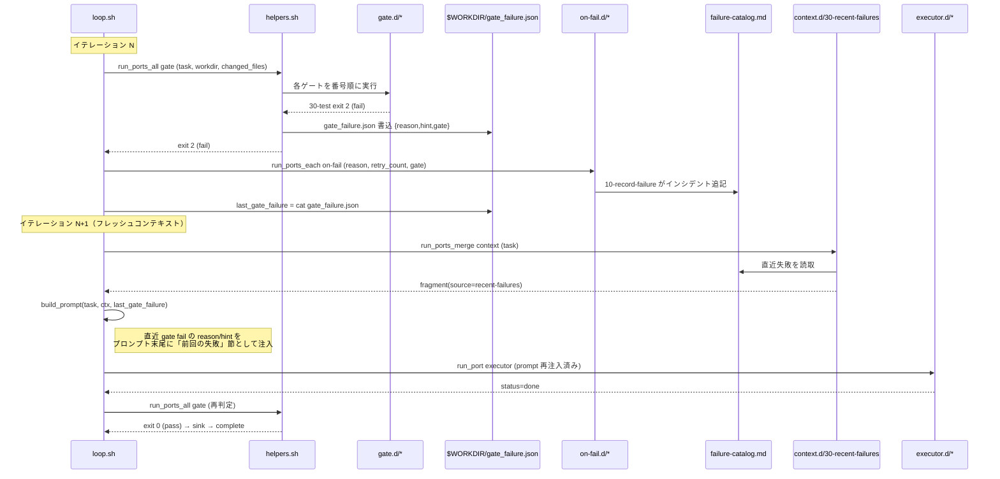

# 詳細設計書 01 — コアループとポート

> **v1.8 追随改訂済み（コア TS 化・specs/ 廃止を反映）**。コアループとポート実行機構は `packages/core`（TypeScript、`runPort` 等）が担う。以下の bash 断片は**実装非依存の擬似コード**として読むこと（プラグイン実体は bash/TS 混在を許容）。spec_refs は `specs/` ファイルではなくナレッジグラフのノード ID（`kg://`）参照へ移行済み。

| 項目 | 内容 |
|---|---|
| 対象 | HALO コアループ（`packages/core` の loop）と 9 ポート＋ `mcp.d` の詳細設計 |
| 典拠 | HALO要件定義書 v1.8 §3〜4.4、ADR-0001（ポート＆アダプタ統一コントラクト）、ADR-0006（自律度レベル）、ADR-0010（コア TypeScript 化）、ADR-0011（specs/ 廃止とグラフ一元化） |
| 前提配置 | 各ポートの JSON Schema は `packages/contracts` から自動生成し配布する |
| 終了コード規約 | Claude Code hooks と同一（exit 0 = pass、exit 2 = fail） |

本書は要件定義書 §4 の抽象を実装レベルへ落とすものであり、要件と矛盾する内容は導入しない。数値パラメータ（retry 上限 3・max-turns 40・timeout 15分等）は §11.2 に従い「仮の初期値」として扱う。

---

## 1. コアループ

コアループは `packages/core`（TypeScript）の固定資産であり、要件定義書 §4.3 の擬似コードを実装する。以降の機能追加はすべて `ports/<port名>.d/` へのファイル追加で完結させ、コア本体は変更しない（変更は loop-audit の自己改変禁止に抵触しうる領域に近く、構造安定性を最優先する）。以下は挙動を示す**擬似コード**（bash 表記だが実体は TS）である。

```bash
# コアループ（擬似コード）— 実体は packages/core（TS）。機能追加はプラグイン側で行う。
# runPort / runPortsMerge 等は packages/core が提供する（旧 helpers.sh の役割）。

last_gate_failure=""                                   # 前周回の gate fail reason（初回は空）
for ((iter = 1; iter <= MAX_ITER; iter++)); do
  [ -f "$HARNESS_ROOT/.halo/STOP" ] && exit 0        # キルスイッチ（各周回冒頭で確認）
  budget_ok || exit 0                                  # 日次予算残チェック

  task=$(run_port task-source '{"op":"next"}')         # タスク取得
  [ "$(jq -r '.task_id' <<<"$task")" = "null" ] && exit 0   # ready 0 件なら即終了

  ctx=$(run_ports_merge context "$task")               # context.d を priority 順に連結
  prompt=$(build_prompt "$task" "$ctx" "$last_gate_failure")
  result=$(run_port executor "$(build_exec_input "$prompt")")

  if [ "$(jq -r '.status' <<<"$result")" = "done" ] && run_ports_all gate "$task"; then
    run_ports_each sink "$task"                         # 合格: 自律度フィルタ後の副作用
    run_port task-source "$(complete_input "$task")"
    last_gate_failure=""
  else
    last_gate_failure=$(cat "$WORKDIR/gate_failure.json" 2>/dev/null || echo '{}')
    run_ports_each on-fail "$(fail_input "$task" "$result")"   # 記録・エスカレーション・sign 候補
  fi
done
```

要点:

- **1 イテレーション 1 タスク**（フレッシュコンテキスト原則、§3.2 原則4）。進捗は LLM コンテキストではなくファイル（git 履歴 / fix_plan.md / gate_failure.json）に永続化する。
- `run_ports_all gate` が 1 つでも fail なら sink・complete を実行せず、reason を `last_gate_failure` に保持して次周回の `build_prompt` で再注入する（§4.2④、後述 §4）。
- executor の `status` が `stuck` / `timeout` の場合も else 節へ落とし、on-fail を起動する（§4.2⑥）。

---

## 2. ポート・コントラクト（JSON Schema）

全ポートは stdin に JSON を受け取り stdout に JSON を返す（ADR-0001）。以下は `harness/contracts/` に配置する JSON Schema（Draft 2020-12）である。`$id` は `https://halo.local/contracts/<port>.<io>.json` を採る。

### 2.1 ① task-source

入力はオペレーション判別のため `op` による oneOf とする。

```json
{
  "$schema": "https://json-schema.org/draft/2020-12/schema",
  "$id": "https://halo.local/contracts/task-source.in.json",
  "title": "task-source input",
  "oneOf": [
    { "type": "object", "required": ["op"],
      "properties": { "op": { "const": "next" } }, "additionalProperties": false },
    { "type": "object", "required": ["op", "task_id", "pr_url"],
      "properties": { "op": { "const": "complete" },
        "task_id": { "type": "string" }, "pr_url": { "type": "string", "format": "uri" } },
      "additionalProperties": false },
    { "type": "object", "required": ["op", "task_id", "reason", "retry_count"],
      "properties": { "op": { "const": "fail" },
        "task_id": { "type": "string" }, "reason": { "type": "string" },
        "retry_count": { "type": "integer", "minimum": 0 } },
      "additionalProperties": false }
  ]
}
```

```json
{
  "$schema": "https://json-schema.org/draft/2020-12/schema",
  "$id": "https://halo.local/contracts/task-source.out.json",
  "title": "task-source output (op=next)",
  "type": "object",
  "required": ["task_id"],
  "properties": {
    "task_id": { "type": ["string", "null"],
      "description": "null はタスク不在（ready 0 件）。この場合コアは exit 0 で即終了" },
    "title": { "type": "string" },
    "body": { "type": "string" },
    "kind": { "type": "string", "default": "code",
      "description": "kind:<name> ラベル由来。無指定時は code（§4.2⑧）" },
    "spec_refs": { "type": "array", "items": { "type": "string" },
      "description": "凍結要件への参照。ナレッジグラフのノード ID（kg:// URI）。loop-audit がグラフ実在照会で検証する（§11.1、specs/ ファイルではない）" },
    "write_set": { "type": "array", "items": { "type": "string" },
      "description": "Phase 5 の並列衝突回避用（任意）" }
  }
}
```

`complete` / `fail` は副作用のみで出力を要求しない（exit 0 = 成功）。GitHub Issues アダプタの挙動は要件 §4.2① の通り（`next` = `--label ready` 先頭を `in-progress` へ付け替えロック、`fail` = 3 回で `needs-human`）。

### 2.2 ② context

```json
{
  "$schema": "https://json-schema.org/draft/2020-12/schema",
  "$id": "https://halo.local/contracts/context.out.json",
  "title": "context output",
  "type": "object",
  "required": ["fragments"],
  "properties": {
    "fragments": {
      "type": "array",
      "items": {
        "type": "object",
        "required": ["source", "content", "priority"],
        "properties": {
          "source": { "type": "string", "description": "codegraph / knowledge / recent-failures 等" },
          "content": { "type": "string" },
          "priority": { "type": "integer",
            "description": "大きいほど優先。コアが降順連結しトークン上限で切詰め" }
        },
        "additionalProperties": false
      }
    }
  }
}
```

入力は task-source の `op=next` 出力（タスク情報）そのもの。コアは全 context プラグインを実行し fragments を priority 降順に連結、トークン上限（§3.2 原則4、100k 未満）で切り詰める。

### 2.3 ③ executor

```json
{
  "$schema": "https://json-schema.org/draft/2020-12/schema",
  "$id": "https://halo.local/contracts/executor.in.json",
  "title": "executor input",
  "type": "object",
  "required": ["prompt", "workdir", "budget"],
  "properties": {
    "prompt": { "type": "string" },
    "workdir": { "type": "string", "description": "使い捨て worktree の絶対パス" },
    "budget": {
      "type": "object",
      "required": ["max_turns", "timeout_sec"],
      "properties": {
        "max_turns": { "type": "integer", "default": 40 },
        "timeout_sec": { "type": "integer", "default": 900 }
      }
    }
  }
}
```

```json
{
  "$schema": "https://json-schema.org/draft/2020-12/schema",
  "$id": "https://halo.local/contracts/executor.out.json",
  "title": "executor output",
  "type": "object",
  "required": ["status", "summary"],
  "properties": {
    "status": { "enum": ["done", "stuck", "timeout"] },
    "summary": { "type": "string" },
    "cost": { "type": "object", "description": "コスト情報（ccusage 相当）。可観測性用に任意" }
  }
}
```

`status != done` はコアの else 節（on-fail 起動）へ落ちる。worktree ライフサイクル（add → runtime 検出 → setup → 実行 → remove）は要件 §4.2③ に従い、bubblewrap の書込許可を workdir に一致させる。

### 2.4 ④ gate

```json
{
  "$schema": "https://json-schema.org/draft/2020-12/schema",
  "$id": "https://halo.local/contracts/gate.in.json",
  "title": "gate input",
  "type": "object",
  "required": ["task_id", "workdir", "changed_files"],
  "properties": {
    "task_id": { "type": "string" },
    "workdir": { "type": "string" },
    "changed_files": { "type": "array", "items": { "type": "string" } }
  }
}
```

```json
{
  "$schema": "https://json-schema.org/draft/2020-12/schema",
  "$id": "https://halo.local/contracts/gate.out.json",
  "title": "gate output (fail only)",
  "type": "object",
  "required": ["reason"],
  "properties": {
    "reason": { "type": "string", "description": "例: coverage 87% < 90%" },
    "hint": { "type": "string", "description": "例: src/order.ts のテスト不足" },
    "gate": { "type": "string", "description": "失敗したゲート名（例: 30-test）" }
  }
}
```

判定は**出力ではなく終了コード**（exit 0 = pass / exit 2 = fail）で行う。fail の gate のみ `gate_failure.json` を `$WORKDIR` に書き出し、コアが次周回で再注入する。gate.d の `10-typecheck` / `20-lint` / `30-test` は実コマンドを持たず採用 runtime の `check.sh` / `test.sh` へ委譲する薄いラッパー。`40-ai-review`（evaluator）・`50-loop-audit`（自己改変禁止等の構造検査、§11.1）も同列のゲート。

### 2.5 ⑤ sink

```json
{
  "$schema": "https://json-schema.org/draft/2020-12/schema",
  "$id": "https://halo.local/contracts/sink.in.json",
  "title": "sink input",
  "type": "object",
  "required": ["task_id", "workdir", "summary"],
  "properties": {
    "task_id": { "type": "string" },
    "workdir": { "type": "string" },
    "summary": { "type": "string" }
  }
}
```

合格後のみ実行。1 つの sink が失敗しても他は続行する（`run_ports_each`、後述 §3）。自律度フィルタは各 sink ファイル冒頭のメタコメント `# min-autonomy: L{1,2,3}` を宣言とし、コアが現在の `AUTONOMY` 未満の sink をスキップする（ADR-0006）。L1=`20-progress-log` のみ、L2=commit + draft PR、L3=通常 PR 作成。

### 2.6 ⑥ on-fail

```json
{
  "$schema": "https://json-schema.org/draft/2020-12/schema",
  "$id": "https://halo.local/contracts/on-fail.in.json",
  "title": "on-fail input",
  "type": "object",
  "required": ["task_id", "reason", "retry_count"],
  "properties": {
    "task_id": { "type": "string" },
    "reason": { "type": "string" },
    "retry_count": { "type": "integer", "minimum": 0 },
    "gate": { "type": "string", "description": "失敗ゲート名（例: 30-test）。executor 起因時は stuck/timeout" },
    "workdir": { "type": "string" }
  }
}
```

gate fail または executor stuck/timeout 時に番号順で全実行。`10-record-failure`（failure-catalog.md へインシデント追記）・`20-escalate`（retry_count が閾値 3 で `needs-human` 付与・in-progress 解除）・`30-suggest-sign`（signs-proposed.md へ sign 候補生成）。

### 2.7 ⑦ runtime

runtime は他ポートと異なりディレクトリ束（`setup.sh` / `check.sh` / `test.sh`）だが、各スクリプトのコントラクトは同一（stdin JSON + 終了コード）。`detect.sh` は持たず選択は `.harness.yml` の宣言による。

```json
{
  "$schema": "https://json-schema.org/draft/2020-12/schema",
  "$id": "https://halo.local/contracts/runtime.in.json",
  "title": "runtime script input (setup/check/test 共通)",
  "type": "object",
  "required": ["workdir"],
  "properties": {
    "workdir": { "type": "string" },
    "changed_files": { "type": "array", "items": { "type": "string" },
      "description": "check/test の対象絞り込み用（任意）" }
  }
}
```

`check.sh` / `test.sh` は exit 2 = fail。`setup.sh` は依存の実体化を高速に行うこと（node-pnpm ハードリンク / python-uv リンク / rust 共有 CARGO_TARGET_DIR）。docs-md は check=markdownlint+リンク切れ+ADRテンプレート準拠、test=用語集整合チェック。

### 2.8 ⑧ kind（.harness.yml）

kind はポートスクリプトではなく `.harness.yml` の宣言。コアは Issue の `kind:<name>` ラベル（無指定時 `code`）から下記 schema に沿う定義を引き、runtime 群とプロンプトテンプレートを決定する。`.harness.yml` 不在のリポジトリはタスク実行せず `needs-human`。

```json
{
  "$schema": "https://json-schema.org/draft/2020-12/schema",
  "$id": "https://halo.local/contracts/harness-yml.json",
  "title": ".harness.yml",
  "type": "object",
  "required": ["kinds"],
  "properties": {
    "kinds": {
      "type": "object",
      "minProperties": 1,
      "additionalProperties": {
        "type": "object",
        "required": ["runtimes", "prompt"],
        "properties": {
          "runtimes": { "type": "array", "minItems": 1, "items": { "type": "string" },
            "description": "runtime.d 配下のディレクトリ名" },
          "prompt": { "type": "string", "description": "プロンプトテンプレートのパス" }
        }
      }
    }
  }
}
```

### 2.9 ⑨ trigger

trigger は `install.sh` / `uninstall.sh` / `fire.sh` の 3 スクリプト束で、run.sh を呼ぶ唯一の入口。`fire.sh` は共通で `bin/run.sh <profile>` を呼ぶ。stdin JSON コントラクトは持たず、引数はプロファイル名のみ。run.sh 以下はトリガー種別を知らない（§4.4）。将来の webhook/manual 差し替えも run.sh 以下は無変更。

### 2.10 補 mcp.d

ポートではなく executor に渡す MCP 構成断片。`ports/mcp.d/*.json` を jq でマージして起動時に `mcp.json` を生成し、`claude -p --mcp-config <mcp.json> --strict-mcp-config` で読ませる（§4.2③）。各断片は MCP サーバー定義オブジェクト（`mcpServers` キー配下）に準拠する。

---

## 3. ポート実行関数の仕様（packages/core）

`packages/core` はコアが使う 4 つのポート実行関数（`runPort` / `runPortsMerge` / `runPortsAll` / `runPortsEach`）を提供する（旧 v1.5 の `core/helpers.sh` に相当）。全関数に共通する規約:

- ポートディレクトリは `$HARNESS_ROOT/harness/ports/<port>.d/`。
- 実行対象は数字プレフィックス昇順（`LC_ALL=C sort` による安定ソート、後述 §5）でソートした**実行可能ファイルのみ**。
- 各プラグインへは第 1 引数の JSON を stdin で渡す。
- プラグインの stdout を捕捉し、stderr は `logs/iter_N.json` へ構造化ログとして退避する。

### 3.1 `run_port <port> <input_json>`

単一アダプタ前提のポート（task-source / executor）に使う。

| 項目 | 内容 |
|---|---|
| 引数 | `$1` = ポート名、`$2` = stdin へ渡す JSON |
| 対象 | `<port>.d/` 内で番号順**先頭**の 1 プラグイン（複数あっても先頭のみ実行） |
| 戻り値（stdout） | プラグインの stdout をそのまま返す |
| 終了コード | プラグインの exit をそのまま伝播 |
| エラー処理 | プラグインが exit 非 0（task-source next で「タスクなし」を意図する exit 0 は正常）→ 呼び出し元へ伝播しコアが判断。プラグイン不在時は exit 1 でコア停止（構成不備） |

### 3.2 `run_ports_merge <port> <input_json>`

context 専用。全プラグインを実行し fragments をマージする。

| 項目 | 内容 |
|---|---|
| 引数 | `$1` = ポート名（context）、`$2` = タスク情報 JSON |
| 対象 | `<port>.d/` 内**全**プラグインを番号順に実行 |
| 戻り値（stdout） | 各プラグインの `.fragments` を結合し priority 降順ソート、トークン上限で切詰めた単一 JSON（`{"fragments":[...]}`）。`build_prompt` がこれを消費 |
| 終了コード | 常に 0（context 取得失敗は致命でない）。個別失敗は当該プラグインを空 fragments 扱いにしログへ記録 |
| エラー処理 | あるプラグインが exit 非 0 / 不正 JSON → そのプラグインをスキップし警告ログ。他は続行（コンテキスト欠落はゲートで検出される前提） |

### 3.3 `run_ports_all <port> <input_json>`

gate 専用。全ゲートを実行し、**1 つでも fail なら全体 fail**（論理 AND）。

| 項目 | 内容 |
|---|---|
| 引数 | `$1` = ポート名（gate）、`$2` = gate 入力 JSON |
| 対象 | `<port>.d/` 内全プラグインを番号順に実行 |
| 戻り値 | stdout は返さない。判定は終了コードで表す |
| 終了コード | 全ゲート exit 0 → 0（pass）。いずれか exit 2 → 2（fail）。最初の fail で `gate_failure.json`（reason/hint/gate）を `$WORKDIR` に書き出す |
| エラー処理 | 全ゲートを止めず実行し reason を集約する方針だが、少なくとも最初の fail を再注入用に確定保存。exit 2 以外の異常終了（例: 1）も安全側に倒して fail 扱い |

### 3.4 `run_ports_each <port> <input_json>`

sink / on-fail 用。全プラグインを独立に実行し、**個別失敗が他へ波及しない**（ベストエフォート）。

| 項目 | 内容 |
|---|---|
| 引数 | `$1` = ポート名（sink / on-fail）、`$2` = 入力 JSON |
| 対象 | `<port>.d/` 内全プラグインを番号順に実行 |
| 自律度フィルタ（sink 時） | 各ファイル先頭 `# min-autonomy:` を読み、`$AUTONOMY` 未満なら実行せずスキップ（ADR-0006） |
| 戻り値 | stdout は返さない |
| 終了コード | 常に 0（1 つの sink 失敗で complete をブロックしない） |
| エラー処理 | 各プラグインを `if ! plugin; then log_warn` で囲み、失敗しても次を実行。全失敗を logs へ記録 |

---

## 4. gate fail reason の次イテレーション再注入シーケンス

gate fail の reason を次周回のプロンプトへ再注入し差し戻すのが学習経路の中核（§4.2④、§3.2 原則7）。失敗は on-fail 経由で failure-catalog.md にも記録され、context.d（`30-recent-failures`）が後続イテレーションへ再注入する二重経路を持つ。



再注入は 2 経路に分かれる:

1. **直近 reason の即時再注入**（`last_gate_failure` 変数）: 同一タスクの次周回で `build_prompt` の第 3 引数として渡り、プロンプトに「前回の失敗（gate 名 / reason / hint）」節を差し込む。retry_count に応じ「前回と別方針で」等の注入戦略変更は context.d 側の拡張余地（§11.2）。
2. **失敗カタログ経由の中期再注入**（context.d `30-recent-failures`）: on-fail が記録した failure-catalog.md を後続イテレーションが読み、同種失敗の再発を抑える。

retry_count が 3（仮）に達したら on-fail `20-escalate` が `needs-human` を付与し再注入ループを打ち切る（無限ループ遮断、§4.2①・§6.2）。

---

## 5. conf.d 方式の活性化規約

ADR-0001 の「ディレクトリ規約による活性化」を実装レベルで明文化する。

- **有効化 / 無効化**: `ports/<port>.d/` にファイル（または runtime/trigger はサブディレクトリ）を**置けば有効、削除すれば無効**。`packages/core` は無変更。効果測定のための ON/OFF はファイル移動のみ（§3.2 原則2 の 1 変数ずつの測定）。
- **実行順 = 数字プレフィックス昇順**: `NN-name.sh`（例 `10-typecheck.sh` → `20-lint.sh` → `30-test.sh`）。helpers は `LC_ALL=C sort` で安定ソートし、番号が同一なら名前順。番号は 10 刻みを基本とし、間への挿入余地を残す。
- **実行可能判定**: 実行ビットが立つファイルのみ対象。`.disabled` 等の拡張子付与や実行ビット除去で「無効化するが残す」を表現できる（削除せずに OFF）。
- **命名衝突回避**: 同一ポート内で番号は一意にする運用とし、衝突時は名前順で決定的に解決する（非決定を作らない）。
- **runtime / trigger のディレクトリ束**: 単一ファイルでなくサブディレクトリ（`runtime.d/<name>/`、`trigger.d/<name>/`）を単位とし、内部の `setup.sh` 等は固定名で参照する。番号プレフィックスは付けない（順序ではなく `.harness.yml` の宣言 / trigger の install で選択されるため）。
- **メタコメント規約**: sink は先頭行に `# min-autonomy: L{1,2,3}` を必須宣言（未宣言は最も安全側 = 実行されうる自律度が最も高い扱い、すなわち L3 とみなし L1/L2 ではスキップ）。

---

## 6. コアループの失敗パス

コアループが取り得る失敗と分岐を整理する。「安全側に倒す（副作用を出さない）」を原則とする。

| # | 失敗事象 | 検出点 | コアの挙動 |
|---|---|---|---|
| 1 | ready タスク 0 件 | task-source `next` が `{"task_id":null}` + exit 0 | 正常終了（exit 0）。副作用なし |
| 2 | STOP ファイル存在 | 各周回冒頭 | 即 exit 0（キルスイッチ、§4.4） |
| 3 | 日次予算超過 | `budget_ok` 失敗 | 即 exit 0（起動しても走らせない、§4.4） |
| 4 | executor stuck / timeout | `result.status != done` | sink・complete を実行せず else 節へ。on-fail 起動 |
| 5 | gate fail（1つ以上） | `run_ports_all gate` exit 2 | sink・complete をスキップ。`gate_failure.json` 保存 → 次周回再注入 → on-fail 起動（§4） |
| 6 | 同一タスク 3 回連続 fail | on-fail `20-escalate` が retry_count 判定 | `needs-human` ラベル付与・in-progress 解除。次 `next` で当該タスクは払い出されない |
| 7 | `.harness.yml` 不在 | executor プリフライトの kind 解決 | タスク実行せず `needs-human`（暗黙自動検出はしない、§4.2③） |
| 8 | 自己改変検出 | gate `50-loop-audit` exit 2 | fail 扱い（#5 経路）。重大インシデントとして即 L1 降格の運用対象（ADR-0006、§11.2） |
| 9 | context プラグイン個別失敗 | `run_ports_merge` 内 | 当該 fragment を空にしログ記録、続行（致命でない、§3.2） |
| 10 | sink 個別失敗 | `run_ports_each` 内 | 他 sink は続行、complete はブロックしない（§2.5・§3.4） |
| 11 | プラグイン不在（構成不備） | `run_port` が対象 0 件 | exit 1 でコア停止（サイレント続行しない） |

いずれの失敗パスでも、変更は使い捨て worktree 内に閉じ、fail 確定時は `git worktree remove --force` で痕跡ごと削除される（§4.2③）。合格しない限り sink（commit / PR）が走らないため、不良成果物が外部へ出る導線は gate 通過を唯一の関門として一元化されている。

---

## 参照

- HALO要件定義書 v1.8 §3（全体アーキテクチャ）、§4.1〜4.4（ポート仕様・コアループ・起動層）、§6.2（暴走・コスト制御）、§11.1〜11.2（確定事項・初期値）
- ADR-0001（ポート＆アダプタ構造と統一コントラクト）
- ADR-0006（自律度レベル L1→L3 の sink フィルタ実装）
</content>
</invoke>
