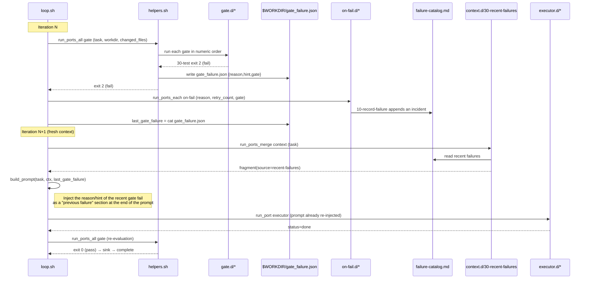

# Detailed Design Document 01 — Core Loop and Ports

> **Revised to follow v1.8 (reflecting the migration of the core to TS and the removal of specs/)**. The core loop and port execution mechanism are handled by `packages/core` (TypeScript, `runPort`, etc.). The bash snippets below should be read as **implementation-independent pseudocode** (the actual plugin implementations may mix bash and TS). spec_refs have already migrated from `specs/` files to knowledge-graph node ID (`kg://`) references.

| Item | Content |
|---|---|
| Scope | Detailed design of the HALO core loop (the loop in `packages/core`) and the 9 ports plus `mcp.d` |
| Basis | HALO Requirements Specification v1.8 §3–4.4, ADR-0001 (unified port-and-adapter contract), ADR-0006 (autonomy levels), ADR-0010 (migrating the core to TypeScript), ADR-0011 (removal of specs/ and unification into the graph) |
| Placement premise | The JSON Schema for each port is auto-generated from `packages/contracts` and distributed |
| Exit-code convention | Same as Claude Code hooks (exit 0 = pass, exit 2 = fail) |

This document translates the abstractions of Requirements Specification §4 down to the implementation level, and introduces nothing that contradicts the requirements. Numeric parameters (retry limit 3, max-turns 40, timeout 15 minutes, etc.) are treated as "provisional initial values" per §11.2.

---

## 1. Core Loop

The core loop is a fixed asset of `packages/core` (TypeScript) and implements the pseudocode of Requirements Specification §4.3. All subsequent feature additions are to be completed by adding files under `ports/<port name>.d/`, without changing the core itself (changes are close to territory that could violate the loop-audit prohibition on self-modification, so structural stability is the top priority). The following is **pseudocode** illustrating the behavior (written in bash notation, but the actual implementation is TS).

```bash
# Core loop (pseudo-code) — the real implementation lives in packages/core (TS). Add features on the plugin side.
# runPort / runPortsMerge etc. are provided by packages/core (the former role of helpers.sh).

last_gate_failure=""                                   # gate fail reason from the previous cycle (empty on first)
for ((iter = 1; iter <= MAX_ITER; iter++)); do
  [ -f "$HARNESS_ROOT/.halo/STOP" ] && exit 0        # kill switch (checked at the start of each cycle)
  budget_ok || exit 0                                  # daily budget remaining check

  task=$(run_port task-source '{"op":"next"}')         # fetch task
  [ "$(jq -r '.task_id' <<<"$task")" = "null" ] && exit 0   # exit immediately if 0 ready tasks

  ctx=$(run_ports_merge context "$task")               # concatenate context.d in priority order
  prompt=$(build_prompt "$task" "$ctx" "$last_gate_failure")
  result=$(run_port executor "$(build_exec_input "$prompt")")

  if [ "$(jq -r '.status' <<<"$result")" = "done" ] && run_ports_all gate "$task"; then
    run_ports_each sink "$task"                         # pass: side effects after autonomy-level filtering
    run_port task-source "$(complete_input "$task")"
    last_gate_failure=""
  else
    last_gate_failure=$(cat "$WORKDIR/gate_failure.json" 2>/dev/null || echo '{}')
    run_ports_each on-fail "$(fail_input "$task" "$result")"   # record, escalate, sign candidates
  fi
done
```

Key points:

- **1 iteration = 1 task** (fresh-context principle, §3.2 principle 4). Progress is persisted to files (git history / fix_plan.md / gate_failure.json) rather than to the LLM context.
- If even one `run_ports_all gate` fails, sink and complete are not executed; the reason is retained in `last_gate_failure` and re-injected in the next iteration's `build_prompt` (§4.2④, described later in §4).
- When the executor's `status` is `stuck` / `timeout`, control also falls through to the else branch and starts on-fail (§4.2⑥).

---

## 2. Port Contracts (JSON Schema)

Every port receives JSON on stdin and returns JSON on stdout (ADR-0001). The following is the JSON Schema (Draft 2020-12) placed in `harness/contracts/`. `$id` takes the form `https://halo.local/contracts/<port>.<io>.json`.

### 2.1 ① task-source

The input is a `oneOf` keyed on `op` in order to discriminate the operation.

```json
{
  "$schema": "https://json-schema.org/draft/2020-12/schema",
  "$id": "https://halo.local/contracts/task-source.in.json",
  "title": "task-source input",
  "oneOf": [
    { "type": "object", "required": ["op"],
      "properties": { "op": { "const": "next" } }, "additionalProperties": false },
    { "type": "object", "required": ["op", "task_id", "pr_url"],
      "properties": { "op": { "const": "complete" },
        "task_id": { "type": "string" }, "pr_url": { "type": "string", "format": "uri" } },
      "additionalProperties": false },
    { "type": "object", "required": ["op", "task_id", "reason", "retry_count"],
      "properties": { "op": { "const": "fail" },
        "task_id": { "type": "string" }, "reason": { "type": "string" },
        "retry_count": { "type": "integer", "minimum": 0 } },
      "additionalProperties": false }
  ]
}
```

```json
{
  "$schema": "https://json-schema.org/draft/2020-12/schema",
  "$id": "https://halo.local/contracts/task-source.out.json",
  "title": "task-source output (op=next)",
  "type": "object",
  "required": ["task_id"],
  "properties": {
    "task_id": { "type": ["string", "null"],
      "description": "null means no task available (0 ready). In this case the core exits immediately with exit 0" },
    "title": { "type": "string" },
    "body": { "type": "string" },
    "kind": { "type": "string", "default": "code",
      "description": "Derived from the kind:<name> label. Defaults to code when unspecified (§4.2⑧)" },
    "spec_refs": { "type": "array", "items": { "type": "string" },
      "description": "References to frozen requirements. Knowledge-graph node IDs (kg:// URIs). loop-audit verifies them via a graph-existence query (§11.1; not specs/ files)" },
    "write_set": { "type": "array", "items": { "type": "string" },
      "description": "For avoiding parallel collisions in Phase 5 (optional)" }
  }
}
```

`complete` / `fail` have side effects only and require no output (exit 0 = success). The behavior of the GitHub Issues adapter is as in Requirements §4.2① (`next` = re-label the head `--label ready` to `in-progress` to lock it; `fail` = `needs-human` after 3 times).

### 2.2 ② context

```json
{
  "$schema": "https://json-schema.org/draft/2020-12/schema",
  "$id": "https://halo.local/contracts/context.out.json",
  "title": "context output",
  "type": "object",
  "required": ["fragments"],
  "properties": {
    "fragments": {
      "type": "array",
      "items": {
        "type": "object",
        "required": ["source", "content", "priority"],
        "properties": {
          "source": { "type": "string", "description": "codegraph / knowledge / recent-failures etc." },
          "content": { "type": "string" },
          "priority": { "type": "integer",
            "description": "Higher means higher priority. The core concatenates in descending order and truncates at the token limit" }
        },
        "additionalProperties": false
      }
    }
  }
}
```

The input is the `op=next` output of task-source (the task information) itself. The core runs all context plugins, concatenates the fragments in descending priority order, and truncates at the token limit (§3.2 principle 4, under 100k).

### 2.3 ③ executor

```json
{
  "$schema": "https://json-schema.org/draft/2020-12/schema",
  "$id": "https://halo.local/contracts/executor.in.json",
  "title": "executor input",
  "type": "object",
  "required": ["prompt", "workdir", "budget"],
  "properties": {
    "prompt": { "type": "string" },
    "workdir": { "type": "string", "description": "Absolute path of the disposable worktree" },
    "budget": {
      "type": "object",
      "required": ["max_turns", "timeout_sec"],
      "properties": {
        "max_turns": { "type": "integer", "default": 40 },
        "timeout_sec": { "type": "integer", "default": 900 }
      }
    }
  }
}
```

```json
{
  "$schema": "https://json-schema.org/draft/2020-12/schema",
  "$id": "https://halo.local/contracts/executor.out.json",
  "title": "executor output",
  "type": "object",
  "required": ["status", "summary"],
  "properties": {
    "status": { "enum": ["done", "stuck", "timeout"] },
    "summary": { "type": "string" },
    "cost": { "type": "object", "description": "Cost info (equivalent to ccusage). Optional, for observability" }
  }
}
```

`status != done` falls into the core's else branch (on-fail startup). The worktree lifecycle (add → runtime detection → setup → execution → remove) follows Requirements §4.2③, and the bubblewrap write permission is matched to the workdir.

### 2.4 ④ gate

```json
{
  "$schema": "https://json-schema.org/draft/2020-12/schema",
  "$id": "https://halo.local/contracts/gate.in.json",
  "title": "gate input",
  "type": "object",
  "required": ["task_id", "workdir", "changed_files"],
  "properties": {
    "task_id": { "type": "string" },
    "workdir": { "type": "string" },
    "changed_files": { "type": "array", "items": { "type": "string" } }
  }
}
```

```json
{
  "$schema": "https://json-schema.org/draft/2020-12/schema",
  "$id": "https://halo.local/contracts/gate.out.json",
  "title": "gate output (fail only)",
  "type": "object",
  "required": ["reason"],
  "properties": {
    "reason": { "type": "string", "description": "e.g. coverage 87% < 90%" },
    "hint": { "type": "string", "description": "e.g. insufficient tests in src/order.ts" },
    "gate": { "type": "string", "description": "Name of the failed gate (e.g. 30-test)" }
  }
}
```

The verdict is determined by the **exit code, not the output** (exit 0 = pass / exit 2 = fail). Only a failing gate writes `gate_failure.json` to `$WORKDIR`, which the core re-injects on the next iteration. The `10-typecheck` / `20-lint` / `30-test` under gate.d have no actual commands of their own and are thin wrappers that delegate to the adopted runtime's `check.sh` / `test.sh`. `40-ai-review` (evaluator) and `50-loop-audit` (structural checks such as the prohibition on self-modification, §11.1) are gates of the same rank.

### 2.5 ⑤ sink

```json
{
  "$schema": "https://json-schema.org/draft/2020-12/schema",
  "$id": "https://halo.local/contracts/sink.in.json",
  "title": "sink input",
  "type": "object",
  "required": ["task_id", "workdir", "summary"],
  "properties": {
    "task_id": { "type": "string" },
    "workdir": { "type": "string" },
    "summary": { "type": "string" }
  }
}
```

Executed only after passing. Even if one sink fails, the others continue (`run_ports_each`, described later in §3). The autonomy filter treats the meta-comment `# min-autonomy: L{1,2,3}` at the top of each sink file as a declaration, and the core skips any sink below the current `AUTONOMY` (ADR-0006). L1 = `20-progress-log` only, L2 = commit + draft PR, L3 = normal PR creation.

### 2.6 ⑥ on-fail

```json
{
  "$schema": "https://json-schema.org/draft/2020-12/schema",
  "$id": "https://halo.local/contracts/on-fail.in.json",
  "title": "on-fail input",
  "type": "object",
  "required": ["task_id", "reason", "retry_count"],
  "properties": {
    "task_id": { "type": "string" },
    "reason": { "type": "string" },
    "retry_count": { "type": "integer", "minimum": 0 },
    "gate": { "type": "string", "description": "Name of the failed gate (e.g. 30-test). stuck/timeout when caused by the executor" },
    "workdir": { "type": "string" }
  }
}
```

On a gate fail or an executor stuck/timeout, all are run in numeric order. `10-record-failure` (appends an incident to failure-catalog.md), `20-escalate` (adds `needs-human` and clears in-progress when retry_count hits the threshold of 3), and `30-suggest-sign` (generates a sign candidate into signs-proposed.md).

### 2.7 ⑦ runtime

Unlike the other ports, runtime is a directory bundle (`setup.sh` / `check.sh` / `test.sh`), but the contract of each script is the same (stdin JSON + exit code). It has no `detect.sh`; selection is by declaration in `.harness.yml`.

```json
{
  "$schema": "https://json-schema.org/draft/2020-12/schema",
  "$id": "https://halo.local/contracts/runtime.in.json",
  "title": "runtime script input (common to setup/check/test)",
  "type": "object",
  "required": ["workdir"],
  "properties": {
    "workdir": { "type": "string" },
    "changed_files": { "type": "array", "items": { "type": "string" },
      "description": "For narrowing the target of check/test (optional)" }
  }
}
```

`check.sh` / `test.sh` use exit 2 = fail. `setup.sh` should materialize dependencies quickly (node-pnpm hard links / python-uv links / rust shared CARGO_TARGET_DIR). For docs-md, check = markdownlint + broken-link check + ADR-template conformance, and test = glossary-consistency check.

### 2.8 ⑧ kind (.harness.yml)

kind is not a port script but a declaration in `.harness.yml`. From the Issue's `kind:<name>` label (`code` when unspecified), the core looks up a definition conforming to the schema below and determines the runtime set and prompt template. A repository without `.harness.yml` does not execute the task and is set to `needs-human`.

```json
{
  "$schema": "https://json-schema.org/draft/2020-12/schema",
  "$id": "https://halo.local/contracts/harness-yml.json",
  "title": ".harness.yml",
  "type": "object",
  "required": ["kinds"],
  "properties": {
    "kinds": {
      "type": "object",
      "minProperties": 1,
      "additionalProperties": {
        "type": "object",
        "required": ["runtimes", "prompt"],
        "properties": {
          "runtimes": { "type": "array", "minItems": 1, "items": { "type": "string" },
            "description": "Directory name under runtime.d" },
          "prompt": { "type": "string", "description": "Path to the prompt template" }
        }
      }
    }
  }
}
```

### 2.9 ⑨ trigger

trigger is a bundle of three scripts, `install.sh` / `uninstall.sh` / `fire.sh`, and is the sole entry point that calls run.sh. `fire.sh` commonly calls `bin/run.sh <profile>`. It has no stdin JSON contract; its only argument is the profile name. Everything below run.sh is unaware of the trigger type (§4.4). Future webhook/manual replacements also leave everything below run.sh unchanged.

### 2.10 Supplement: mcp.d

Not a port, but an MCP configuration fragment passed to the executor. `ports/mcp.d/*.json` are merged with jq to generate `mcp.json` at startup, which is read via `claude -p --mcp-config <mcp.json> --strict-mcp-config` (§4.2③). Each fragment conforms to an MCP server definition object (under the `mcpServers` key).

---

## 3. Specification of the Port Execution Functions (packages/core)

`packages/core` provides the four port execution functions used by the core (`runPort` / `runPortsMerge` / `runPortsAll` / `runPortsEach`) (equivalent to the old v1.5 `core/helpers.sh`). Conventions common to all functions:

- The port directory is `$HARNESS_ROOT/harness/ports/<port>.d/`.
- The execution targets are **only executable files**, sorted by ascending numeric prefix (a stable sort via `LC_ALL=C sort`, described later in §5).
- The JSON of the first argument is passed to each plugin on stdin.
- The plugin's stdout is captured, and stderr is set aside into `logs/iter_N.json` as a structured log.

### 3.1 `run_port <port> <input_json>`

Used for ports that assume a single adapter (task-source / executor).

| Item | Content |
|---|---|
| Arguments | `$1` = port name, `$2` = JSON to pass to stdin |
| Target | The **first** plugin in numeric order within `<port>.d/` (only the first is run even if there are multiple) |
| Return value (stdout) | Returns the plugin's stdout as-is |
| Exit code | Propagates the plugin's exit as-is |
| Error handling | If the plugin exits non-zero (an exit 0 intended by task-source next to mean "no task" is normal) → propagated to the caller, and the core decides. If the plugin is absent, exit 1 halts the core (configuration defect) |

### 3.2 `run_ports_merge <port> <input_json>`

context-only. Runs all plugins and merges the fragments.

| Item | Content |
|---|---|
| Arguments | `$1` = port name (context), `$2` = task information JSON |
| Target | Runs **all** plugins within `<port>.d/` in numeric order |
| Return value (stdout) | A single JSON (`{"fragments":[...]}`) that joins each plugin's `.fragments`, sorts them in descending priority order, and truncates at the token limit. `build_prompt` consumes this |
| Exit code | Always 0 (a failure to obtain context is not fatal). An individual failure treats that plugin as empty fragments and records it to the log |
| Error handling | If a plugin exits non-zero / returns invalid JSON → that plugin is skipped and a warning is logged. Others continue (on the premise that missing context will be detected by the gate) |

### 3.3 `run_ports_all <port> <input_json>`

gate-only. Runs all gates, and **if even one fails, the whole thing fails** (logical AND).

| Item | Content |
|---|---|
| Arguments | `$1` = port name (gate), `$2` = gate input JSON |
| Target | Runs all plugins within `<port>.d/` in numeric order |
| Return value | Does not return stdout. The verdict is expressed by the exit code |
| Exit code | All gates exit 0 → 0 (pass). Any exit 2 → 2 (fail). On the first fail, writes `gate_failure.json` (reason/hint/gate) to `$WORKDIR` |
| Error handling | The policy is to run all gates without stopping and aggregate the reasons, but at minimum the first fail is definitively saved for re-injection. Abnormal terminations other than exit 2 (e.g., 1) are also treated as fail, erring on the safe side |

### 3.4 `run_ports_each <port> <input_json>`

For sink / on-fail. Runs all plugins independently, so that **an individual failure does not propagate to others** (best-effort).

| Item | Content |
|---|---|
| Arguments | `$1` = port name (sink / on-fail), `$2` = input JSON |
| Target | Runs all plugins within `<port>.d/` in numeric order |
| Autonomy filter (for sink) | Reads the leading `# min-autonomy:` of each file and skips it without running if below `$AUTONOMY` (ADR-0006) |
| Return value | Does not return stdout |
| Exit code | Always 0 (a single sink failure does not block complete) |
| Error handling | Each plugin is wrapped in `if ! plugin; then log_warn`, so the next runs even on failure. All failures are recorded to logs |

---

## 4. Sequence for Re-injecting a gate fail reason into the Next Iteration

Re-injecting the reason of a gate fail into the next iteration's prompt to send it back is the core of the learning path (§4.2④, §3.2 principle 7). A failure is also recorded to failure-catalog.md via on-fail, giving a dual path where context.d (`30-recent-failures`) re-injects it into subsequent iterations.



Re-injection splits into 2 paths:

1. **Immediate re-injection of the most recent reason** (the `last_gate_failure` variable): On the next iteration of the same task, it is passed as the third argument of `build_prompt` and inserts a "previous failure (gate name / reason / hint)" section into the prompt. Changing the injection strategy based on retry_count (e.g., "take a different approach than last time") is room for extension on the context.d side (§11.2).
2. **Medium-term re-injection via the failure catalog** (context.d `30-recent-failures`): Subsequent iterations read the failure-catalog.md recorded by on-fail, suppressing recurrence of the same kind of failure.

When retry_count reaches 3 (provisional), on-fail `20-escalate` adds `needs-human` and terminates the re-injection loop (infinite-loop cutoff, §4.2①, §6.2).

---

## 5. Activation Convention of the conf.d Approach

This makes ADR-0001's "activation by directory convention" explicit at the implementation level.

- **Enabling / disabling**: Placing a file (or, for runtime/trigger, a subdirectory) in `ports/<port>.d/` **enables it; deleting it disables it**. `packages/core` is unchanged. ON/OFF for measuring effect is just moving files (one-variable-at-a-time measurement of §3.2 principle 2).
- **Execution order = ascending numeric prefix**: `NN-name.sh` (e.g., `10-typecheck.sh` → `20-lint.sh` → `30-test.sh`). helpers do a stable sort with `LC_ALL=C sort`, and if the numbers are identical, order by name. Numbers are basically in increments of 10, leaving room to insert in between.
- **Executability determination**: Only files with the execute bit set are targets. Adding an extension such as `.disabled` or removing the execute bit can express "disable but keep" (OFF without deletion).
- **Avoiding naming collisions**: Operationally, numbers are kept unique within the same port, and on collision the order is resolved deterministically by name (creating no non-determinism).
- **Directory bundles for runtime / trigger**: The unit is a subdirectory (`runtime.d/<name>/`, `trigger.d/<name>/`) rather than a single file, and the internal `setup.sh` etc. are referenced by fixed names. No numeric prefix is added (because selection is not by order but by declaration in `.harness.yml` / by the trigger's install).
- **Meta-comment convention**: A sink must declare `# min-autonomy: L{1,2,3}` on its first line (an undeclared sink is treated as the safest side = the highest autonomy at which it could run, i.e., regarded as L3 and skipped at L1/L2).

---

## 6. Failure Paths of the Core Loop

This organizes the failures the core loop can take and their branches. The principle is to "err on the safe side (produce no side effects)."

| # | Failure event | Detection point | Core behavior |
|---|---|---|---|
| 1 | 0 ready tasks | task-source `next` returns `{"task_id":null}` + exit 0 | Normal termination (exit 0). No side effects |
| 2 | STOP file exists | Head of each iteration | Immediate exit 0 (kill switch, §4.4) |
| 3 | Daily budget exceeded | `budget_ok` fails | Immediate exit 0 (do not run even if started, §4.4) |
| 4 | executor stuck / timeout | `result.status != done` | Does not execute sink/complete, goes to the else branch. Starts on-fail |
| 5 | gate fail (one or more) | `run_ports_all gate` exit 2 | Skips sink/complete. Saves `gate_failure.json` → re-injects next iteration → starts on-fail (§4) |
| 6 | Same task fails 3 times in a row | on-fail `20-escalate` judges retry_count | Adds `needs-human` label, clears in-progress. That task is not dispensed on the next `next` |
| 7 | `.harness.yml` absent | kind resolution in the executor preflight | Does not execute the task, sets `needs-human` (no implicit auto-detection, §4.2③) |
| 8 | Self-modification detected | gate `50-loop-audit` exit 2 | Treated as fail (path #5). Subject to operational immediate demotion to L1 as a serious incident (ADR-0006, §11.2) |
| 9 | Individual context plugin failure | Inside `run_ports_merge` | Empties that fragment and logs it, continues (not fatal, §3.2) |
| 10 | Individual sink failure | Inside `run_ports_each` | Other sinks continue, complete is not blocked (§2.5, §3.4) |
| 11 | Plugin absent (configuration defect) | `run_port` has 0 targets | exit 1 halts the core (does not silently continue) |

On any failure path, changes are confined within the disposable worktree, and once a fail is confirmed they are removed along with all traces via `git worktree remove --force` (§4.2③). Since sink (commit / PR) does not run unless the run passes, the pathway by which a defective artifact reaches the outside is unified with gate passage as the sole checkpoint.

---

## References

- HALO Requirements Specification v1.8 §3 (overall architecture), §4.1–4.4 (port specs, core loop, startup layer), §6.2 (runaway and cost control), §11.1–11.2 (settled matters, initial values)
- ADR-0001 (port-and-adapter structure and unified contract)
- ADR-0006 (sink filter implementation of autonomy levels L1→L3)
