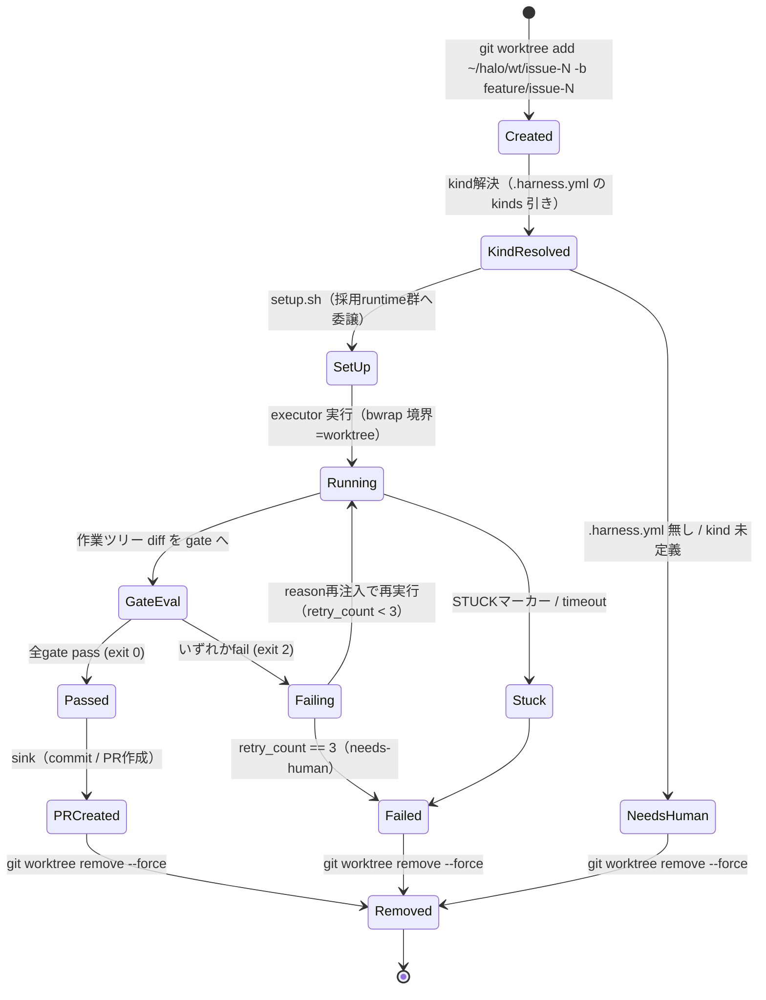

# 詳細設計書 02 — executor / worktree / runtime

> **v1.8 追随改訂済み（コア TS 化・specs/ 廃止を反映）**。呼び出し元のコアは `packages/core`（TypeScript）。executor 実体（`ports/executor.d/10-claude-headless.sh`）は bash プラグインのまま許容する（統一コントラクトに従う限り言語自由）。

| 項目 | 内容 |
|---|---|
| 対象範囲 | ポート③ executor、使い捨て worktree ライフサイクル、ポート⑦ runtime、ポート⑧ kind（`.harness.yml`） |
| 典拠 | HALO要件定義書 v1.8 §4.2③⑦⑧、ADR-0002（使い捨て worktree）、ADR-0007（runtime=成果物種別）、ADR-0010（コア TypeScript 化） |
| ステータス | 実装フェーズ着手可能（Phase 1 で executor + runtime 1種、Phase 3 で docs-md 初運用） |
| 呼び出し元 | 本書はコア（`packages/core`）から `runPort('executor', ...)` として呼ばれる executor と、その内部で委譲される runtime/kind の詳細を定義する。設計書 01（ports 総論）から本書へリンクされる想定 |

本書は要件定義書 §4.2 の contract を実装レベルへ落とし込む詳細設計であり、要件定義書と矛盾する仕様は定義しない。数値（`--max-turns 40`、timeout 15分、retry 3回等）はすべて要件定義書 §6.2・§11.2 の初期値を踏襲する。

---

## 1. executor（`claude -p` 実行コマンド仕様）

### 1.1 コントラクト（要件定義書 §4.2③）

executor は他ポートと同一の「stdin JSON + stdout JSON + 終了コード」規約に従う薄いアダプタ（`ports/executor.d/10-claude-headless.sh`）である。

```
入力(stdin): {"prompt": "...", "workdir": "/home/<user>/halo/wt/issue-<N>",
              "budget": {"max_turns": 40, "timeout_sec": 900}}
出力(stdout): {"status": "done|stuck|timeout", "summary": "...", "cost": {...}}
```

- `status` は `done`（正常終了）/ `stuck`（STUCK マーカー出力を検出）/ `timeout`（`timeout_sec` 超過）の3値。gate 判定は行わない（合否は gate ポートの責務）。
- executor は成果物の正しさを判断しない。作業結果は worktree の作業ツリー（未コミットの diff）として残し、gate ポートがそれを検査する。

### 1.2 実行コマンド骨子

要件定義書 §4.2③の骨子を実装形に展開する。

```bash
timeout "${budget_timeout_sec}" \
bwrap --bind "$workdir" "$workdir" \
      --ro-bind /usr /usr \
      --dev /dev --proc /proc --tmpfs /tmp \
      --chdir "$workdir" \
  claude -p "$PROMPT" \
    --mcp-config "$HARNESS_ROOT/mcp.json" \
    --strict-mcp-config \
    --allowedTools "mcp__codegraph__*,mcp__knowledge__*,Edit,Write,Bash" \
    --max-turns "${budget_max_turns}"
```

各フラグの設計意図:

| フラグ | 値 | 意図 |
|---|---|---|
| `--mcp-config` | `$HARNESS_ROOT/mcp.json` | ハーネス管理の生成物のみを MCP 構成として渡す（§1.3 参照） |
| `--strict-mcp-config` | （無引数） | プロジェクト内 `.mcp.json` とユーザーグローバル設定を無視し、ツール可視範囲を確定する。再現性とセキュリティ（プロンプトインジェクションで未知ツールを掴ませない）のため必須 |
| `--allowedTools` | MCP 2種 + `Edit,Write,Bash` | ツール許可の最小化。codegraph/knowledge の read-only MCP と最小の編集・実行ツールに限定。要件定義書 §6.1 のツール許可最小化に対応 |
| `--max-turns` | `budget.max_turns`（初期40） | ターン暴走の遮断（§6.2）。budget として実行時に注入し、プロファイル差し替えを可能にする |

- `timeout` は 15分/iteration（初期値、§6.2）を外側で強制し、超過時 executor は `{"status":"timeout"}` を返す。
- bubblewrap の `--bind` 書込許可は **worktree ディレクトリに一致**させる（§2.5、ADR-0002）。`~/.ssh` / `~/.aws` は `sandbox.denyRead` により読取禁止（§6.1）。
- Windows パス継承問題の回避のため、executor 起動前に PATH を Linux 側のみへ洗い直す（§6.1）。

### 1.3 mcp.json の生成（jq マージ）

`mcp.json` は静的ファイルではなく、**起動時に `ports/mcp.d/*.json` を番号順に jq マージして生成**する。ディレクトリ規約による活性化（§3.2）を MCP 構成にも適用し、断片の追加・削除だけで executor に渡るツール集合を変えられるようにする。

生成データフロー:

```
ports/mcp.d/10-codegraph.json ┐
ports/mcp.d/20-knowledge.json ┼─ jq -s reduce .[] as $x ({}; . * $x) ─→ $HARNESS_ROOT/mcp.json
（将来: 30-github.json 等）   ┘        （mcpServers を deep-merge）
```

- 各断片は `{"mcpServers": {"<name>": {...}}}` 形式の部分構成とする。
- マージは番号順（`conf.d` 方式）で行い、後勝ちの deep-merge とする。実装例: `jq -s 'reduce .[] as $x ({}; . * $x)' ports/mcp.d/*.json > mcp.json`。
- 生成タイミングはプリフライト（軽量段は不要、重量段で1回）。生成物は `--strict-mcp-config` により唯一の MCP ソースとなる。
- `mcp.d` 断片データスキーマ:

| フィールド | 型 | 必須 | 説明 |
|---|---|---|---|
| `mcpServers` | object | ○ | サーバー名をキーとするマップ |
| `mcpServers.<name>.command` | string | ○ | 起動コマンド（例: knowledge MCP のエントリ） |
| `mcpServers.<name>.args` | string[] | 任意 | 引数 |
| `mcpServers.<name>.env` | object | 任意 | 環境変数。knowledge MCP は read-only でグラフを開く指定を含む |

---

## 2. 使い捨て worktree ライフサイクル

### 2.1 原則（ADR-0002）

1 Issue = 1 ブランチ = 1 worktree。AI の作業はすべて生滅する worktree 内で行い、人間の作業ディレクトリと物理分離する。フレッシュコンテキスト原則をファイルシステムにも適用し、cleanup ロジックのバグが構造的に存在しない状態（後始末は削除一発）を作る。

### 2.2 状態遷移図



要件定義書 §4.2③の骨子 `add → runtime 検出 → setup → 実行 → (pass: PR / fail: そのまま) → remove` を、retry ループ（§6.2 の同一 Issue 3回 fail で needs-human）と kind 解決失敗経路を含めて詳細化したもの。

### 2.3 各状態の処理

| 状態 | 処理 | 典拠 |
|---|---|---|
| Created | `git worktree add ~/halo/wt/issue-<N> -b feature/issue-<N>`。同一ブランチの二重チェックアウトは git が禁止（並列時の衝突防止を無料で得る） | §4.2③1、ADR-0002 |
| KindResolved | Issue ラベル `kind:<name>`（無指定は `code`）から `.harness.yml` の `kinds` を引き、runtime 群とプロンプトテンプレートを決定。`.harness.yml` 無し or 未定義 kind は NeedsHuman へ（暗黙検出しない） | §4.2③2⑧、ADR-0007 |
| SetUp | 採用 runtime 群の `setup.sh` に委譲（env 注入・依存実体化・キャッシュ外出し） | §4.2③3⑦ |
| Running | bubblewrap 書込許可を worktree に一致させて executor 実行 | §4.2③4 |
| Failing→Running | gate の reason を次イテレーションのプロンプトへ再注入して差し戻す | §4.2④ |
| Removed | pass 時は PR 作成後、fail 確定（3回）/needs-human 時はそのまま `git worktree remove --force` | §4.2③5 |

### 2.4 bubblewrap 境界一致

executor（§1.2）の bubblewrap `--bind` は worktree ディレクトリと同一パスに固定する。これにより「サンドボックス境界 = タスクの作業スコープ」となり、監査上「このタスクが触れた場所」が worktree ディレクトリに閉じる（ADR-0002 Consequences）。worktree 外の共有キャッシュ（`~/halo/cache/`）は正しさに影響しない範囲でのみ書込を許容し、破損は gate が検出する前提とする。

### 2.5 配置制約（WSL2 ext4）

リンクベースの依存共有・ハードリンク共有は**同一ファイルシステム内でのみ有効**なため、以下はすべて WSL2 の ext4 側（`/home` 配下）に置く。`/mnt/c/`（Windows ドライブ）配下への配置は禁止する（§4.2⑦ 配置制約）。

| 対象 | 配置 | 理由 |
|---|---|---|
| `wt/`（worktree 置き場） | `/home/<user>/halo/wt/` | ストアとの同一FS内リンクを成立させる |
| 各 runtime のストア | `/home` 配下（pnpm store / uv cache / CARGO_TARGET_DIR） | ハードリンク・リンクベース sync の前提 |
| `cache/`（横断キャッシュ） | `/home/<user>/halo/cache/` | 同上。破損時も gate が検出 |

---

## 3. `.harness.yml`（kind）スキーマ定義

### 3.1 位置づけ（要件定義書 §4.2⑧、ADR-0007）

対象リポジトリのルートに **必須**。存在しなければタスクを実行せず `needs-human` とする（暗黙の runtime 自動検出は行わない）。kind は「使用 runtime 群」と「プロンプトテンプレート」の2つを切り替える。

### 3.2 スキーマ

```yaml
# .harness.yml（対象リポジトリのルートに必須）
kinds:
  <kind名>:                    # 例: code, docs（Issue ラベル kind:<name> に対応）
    runtimes: [<runtime名>, ...] # ports/runtime.d/<name>/ を参照。1つ以上
    prompt: <パス>              # プロンプトテンプレート（リポジトリ相対）
```

具体例（要件定義書 §4.2⑧より）:

```yaml
kinds:
  code:
    runtimes: [node-pnpm]
    prompt: prompts/code.md
  docs:
    runtimes: [docs-md]
    prompt: prompts/docs.md
```

### 3.3 フィールド定義

| フィールド | 型 | 必須 | 制約・意味 |
|---|---|---|---|
| `kinds` | object | ○ | kind 名をキーとするマップ。最低1エントリ |
| `kinds.<name>` | object | ○ | kind 定義。`<name>` は Issue ラベル `kind:<name>` と一致（無指定 Issue は `code` に解決） |
| `kinds.<name>.runtimes` | string[] | ○ | 採用 runtime 名の配列。各要素は `ports/runtime.d/<name>/` に実在すること。実在しなければ needs-human |
| `kinds.<name>.prompt` | string | ○ | プロンプトテンプレートのリポジトリ相対パス。code 系はテスト必須等、docs 系は ADR フォーマット準拠・用語集語彙使用等を含む（指示分離） |

### 3.4 解決規則

- Issue に `kind:` ラベルが無い場合は `code` を既定とする（§4.2⑧）。
- `.harness.yml` 欠如、または該当 kind 未定義、または参照 runtime 不在のいずれも `needs-human` へ（再現性優先、ADR-0007 代替案2 却下理由）。
- `runtimes` が複数の場合の gate 実行順・部分失敗の扱いは要件定義書 §11.3 で保留（モノレポ案件発生時に決定）。本設計では単一 runtime を前提とし、複数指定時は配列順に setup/check/test を実行する素朴実装に留める。

---

## 4. runtime（4種）の仕様と差分表

### 4.1 インターフェース仕様（要件定義書 §4.2⑦、ADR-0007）

runtime は「言語」ではなく「成果物の種類」を吸収するプラグイン。コード（node-pnpm / python-uv / rust）と文書（docs-md）を同列に扱う。1ディレクトリに3スクリプトを束ねる。

```
ports/runtime.d/<name>/
├── setup.sh    # env注入 + 依存実体化 + キャッシュ外出し設定
├── check.sh    # 静的検査（exit 2 = fail）
└── test.sh     # 動的検証（exit 2 = fail）
```

| スクリプト | コントラクト | 呼び出し元 |
|---|---|---|
| `setup.sh` | stdin JSON（workdir 等）を受け、依存を worktree 内へ高速に実体化。env 注入・キャッシュ外出しを行う | worktree ライフサイクルの SetUp（§2.3） |
| `check.sh` | 静的検査。exit 0 = pass / exit 2 = fail（Claude Code hooks と同一規約） | gate.d `10-typecheck.sh` / `20-lint.sh`（薄いラッパー） |
| `test.sh` | 動的検証。exit 0 = pass / exit 2 = fail | gate.d `30-test.sh`（薄いラッパー） |

- コントラクトは他ポートと同一（stdin JSON + 終了コード）。
- runtime の選択は `.harness.yml` の宣言によるため **`detect.sh` は持たない**（ADR-0007）。
- gate.d の `10-typecheck.sh` / `20-lint.sh` / `30-test.sh` は実コマンドを持たず、採用 runtime の `check.sh` / `test.sh` へ委譲する薄いラッパー。実装コマンドの所在は runtime に一元化し、gate・executor・コアは無変更で新種別に対応する。
- **抽象要件（ADR-0002 Negative）**: 使い捨て方式では setup が毎回走るため、各 runtime は「依存の実体化を高速に行えること」を満たす。実現手段は runtime の実装詳細。

### 4.2 4実装の差分表

| 項目 | node-pnpm | python-uv | rust | docs-md |
|---|---|---|---|---|
| 吸収する成果物種別 | Node/TS コード | Python コード | Rust コード | 文書（設計書 / ADR） |
| `setup.sh` 依存実体化 | `pnpm --offline`（グローバルストアのハードリンク共有） | `uv sync`（リンクベース） | 共有 `CARGO_TARGET_DIR` を指すのみ | ほぼ noop |
| 高速化の手段（同一FS前提） | pnpm グローバルストア → worktree へハードリンク | uv cache → リンクベース sync | ビルド成果物を worktree 外の共有ターゲットへ | なし（依存なし） |
| `check.sh`（静的検査） | tsc + eslint | mypy + ruff | cargo check + clippy | markdownlint + リンク切れ + ADR テンプレート準拠 |
| `test.sh`（動的検証） | vitest | pytest | cargo test | 用語集整合チェック（文書中のドメイン用語をナレッジグラフの用語集ノードと照合） |
| キャッシュ外出し先 | `~/halo/cache/`（pnpm store は `/home` 配下） | `~/halo/cache/`（uv cache は `/home` 配下） | 共有 `CARGO_TARGET_DIR`（`/home` 配下） | 対象外 |
| 導入 Phase | Phase 1（runtime 1種の候補） | 拡張 | 拡張 | Phase 3（kind:docs 初運用） |

### 4.3 docs-md の特記事項

- `check`: markdownlint + リンク切れ検出 + ADR テンプレート準拠チェック。
- `test`: **用語集整合チェック**。文書中のドメイン用語をナレッジグラフの用語集ノード（ユビキタス言語）と照合し、ユビキタス言語を自動ゲート化する。
- 厳密度の初期方針（§11.2）: block は禁止語違反（`deprecated` / `synonyms`）のみ。未登録用語は PR 本文への追加候補提案に留め、block しない（過剰 block の緩和、ADR-0007 Risks）。厳密度は docs タスク10件の実績後に調整。

---

## 受入基準チェック

| 受入基準 | 対応セクション |
|---|---|
| worktree 状態遷移図が記載されている | §2.2（Mermaid stateDiagram） |
| runtime インターフェース仕様と4実装の差分表がある | §4.1（インターフェース）+ §4.2（差分表） |
| `.harness.yml` のスキーマ定義がある | §3.2（スキーマ）+ §3.3（フィールド定義） |
