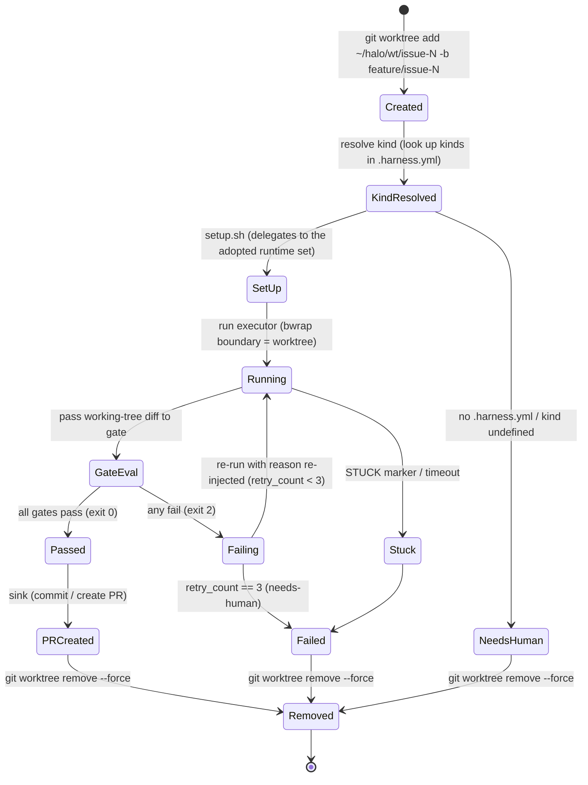

# Detailed Design Document 02 — executor / worktree / runtime

> **Revised to follow v1.8 (reflecting the core migration to TS and the removal of specs/)**. The calling core is `packages/core` (TypeScript). The executor implementation (`ports/executor.d/10-claude-headless.sh`) is allowed to remain a bash plugin (language is free as long as it follows the unified contract).

| Item | Content |
|---|---|
| Scope | Port ③ executor, disposable worktree lifecycle, port ⑦ runtime, port ⑧ kind (`.harness.yml`) |
| Basis | HALO Requirements Specification v1.8 §4.2③⑦⑧, ADR-0002 (disposable worktree), ADR-0007 (runtime = artifact type), ADR-0010 (core migration to TypeScript) |
| Status | Ready to begin the implementation phase (executor + 1 runtime in Phase 1, first operation of docs-md in Phase 3) |
| Caller | This document defines the executor called from the core (`packages/core`) as `runPort('executor', ...)`, along with the details of the runtime/kind delegated within it. It is expected to be linked from Design Document 01 (ports overview) to this document |

This document is a detailed design that translates the contract in §4.2 of the Requirements Specification down to the implementation level; it does not define any specification that conflicts with the Requirements Specification. All numeric values (`--max-turns 40`, 15-minute timeout, 3 retries, etc.) follow the initial values in §6.2 and §11.2 of the Requirements Specification.

---

## 1. executor (`claude -p` execution command specification)

### 1.1 Contract (Requirements Specification §4.2③)

The executor is a thin adapter (`ports/executor.d/10-claude-headless.sh`) that follows the same "stdin JSON + stdout JSON + exit code" convention as the other ports.

```
input(stdin): {"prompt": "...", "workdir": "/home/<user>/halo/wt/issue-<N>",
              "budget": {"max_turns": 40, "timeout_sec": 900}}
output(stdout): {"status": "done|stuck|timeout", "summary": "...", "cost": {...}}
```

- `status` takes one of three values: `done` (normal completion) / `stuck` (a STUCK marker output was detected) / `timeout` (`timeout_sec` exceeded). It does not make gate decisions (pass/fail is the responsibility of the gate ports).
- The executor does not judge the correctness of the artifact. Work results remain as the worktree's working tree (uncommitted diff), and the gate ports inspect it.

### 1.2 Execution command skeleton

The skeleton of §4.2③ of the Requirements Specification is expanded into an implementation form.

```bash
timeout "${budget_timeout_sec}" \
bwrap --bind "$workdir" "$workdir" \
      --ro-bind /usr /usr \
      --dev /dev --proc /proc --tmpfs /tmp \
      --chdir "$workdir" \
  claude -p "$PROMPT" \
    --mcp-config "$HARNESS_ROOT/mcp.json" \
    --strict-mcp-config \
    --allowedTools "mcp__codegraph__*,mcp__knowledge__*,Edit,Write,Bash" \
    --max-turns "${budget_max_turns}"
```

Design intent of each flag:

| Flag | Value | Intent |
|---|---|---|
| `--mcp-config` | `$HARNESS_ROOT/mcp.json` | Pass only the harness-managed generated artifact as the MCP configuration (see §1.3) |
| `--strict-mcp-config` | (no argument) | Ignore the project's `.mcp.json` and the user's global settings, fixing the range of tool visibility. Required for reproducibility and security (so that unknown tools cannot be handed over via prompt injection) |
| `--allowedTools` | 2 MCP kinds + `Edit,Write,Bash` | Minimization of tool permissions. Limited to the read-only MCPs codegraph/knowledge and the minimal editing/execution tools. Corresponds to the tool permission minimization in §6.1 of the Requirements Specification |
| `--max-turns` | `budget.max_turns` (initial 40) | Cutting off turn runaway (§6.2). Injected as budget at execution time, enabling profile substitution |

- `timeout` enforces 15 minutes/iteration (initial value, §6.2) on the outside, and on exceeding it the executor returns `{"status":"timeout"}`.
- The bubblewrap `--bind` write permission is **matched to the worktree directory** (§2.5, ADR-0002). `~/.ssh` / `~/.aws` are read-prohibited by `sandbox.denyRead` (§6.1).
- To avoid the Windows path inheritance problem, PATH is cleaned to the Linux side only before starting the executor (§6.1).

### 1.3 Generating mcp.json (jq merge)

`mcp.json` is not a static file; it is **generated at startup by merging `ports/mcp.d/*.json` in numeric order with jq**. The directory-convention-based activation (§3.2) is also applied to the MCP configuration, so that the set of tools passed to the executor can be changed just by adding or removing fragments.

Generation data flow:

```
ports/mcp.d/10-codegraph.json ┐
ports/mcp.d/20-knowledge.json ┼─ jq -s reduce .[] as $x ({}; . * $x) ─→ $HARNESS_ROOT/mcp.json
(future: 30-github.json etc.) ┘        (deep-merge mcpServers)
```

- Each fragment is a partial configuration of the form `{"mcpServers": {"<name>": {...}}}`.
- The merge is done in numeric order (the `conf.d` style), a last-wins deep-merge. Implementation example: `jq -s 'reduce .[] as $x ({}; . * $x)' ports/mcp.d/*.json > mcp.json`.
- The generation timing is preflight (not needed in the lightweight stage, once in the heavyweight stage). The generated artifact becomes the sole MCP source by virtue of `--strict-mcp-config`.
- `mcp.d` fragment data schema:

| Field | Type | Required | Description |
|---|---|---|---|
| `mcpServers` | object | ○ | Map keyed by server name |
| `mcpServers.<name>.command` | string | ○ | Startup command (e.g., the entry of the knowledge MCP) |
| `mcpServers.<name>.args` | string[] | Optional | Arguments |
| `mcpServers.<name>.env` | object | Optional | Environment variables. The knowledge MCP includes a specification to open the graph read-only |

---

## 2. Disposable worktree lifecycle

### 2.1 Principle (ADR-0002)

1 Issue = 1 branch = 1 worktree. All of the AI's work is done inside an ephemeral worktree, physically separated from the human's working directory. The fresh-context principle is applied to the filesystem as well, creating a state where bugs in cleanup logic are structurally absent (cleanup is a single deletion).

### 2.2 State transition diagram



This is a detailing of the §4.2③ skeleton `add → runtime detection → setup → execute → (pass: PR / fail: leave as-is) → remove`, including the retry loop (needs-human after 3 fails on the same Issue in §6.2) and the kind resolution failure path.

### 2.3 Processing of each state

| State | Processing | Basis |
|---|---|---|
| Created | `git worktree add ~/halo/wt/issue-<N> -b feature/issue-<N>`. git prohibits double-checkout of the same branch (collision prevention during parallel execution is obtained for free) | §4.2③1, ADR-0002 |
| KindResolved | From the Issue label `kind:<name>` (defaults to `code` if unspecified), look up `kinds` in `.harness.yml` and determine the runtime set and the prompt template. Missing `.harness.yml` or an undefined kind goes to NeedsHuman (no implicit detection) | §4.2③2⑧, ADR-0007 |
| SetUp | Delegated to the `setup.sh` of the adopted runtime set (env injection, dependency materialization, cache externalization) | §4.2③3⑦ |
| Running | Run the executor with the bubblewrap write permission matched to the worktree | §4.2③4 |
| Failing→Running | Re-inject the gate's reason into the prompt of the next iteration and send it back | §4.2④ |
| Removed | On pass, after PR creation; on confirmed fail (3 times) / needs-human, `git worktree remove --force` as-is | §4.2③5 |

### 2.4 Bubblewrap boundary matching

The bubblewrap `--bind` of the executor (§1.2) is fixed to the same path as the worktree directory. This makes "sandbox boundary = task's work scope", so that from an audit standpoint "the places this task touched" are confined to the worktree directory (ADR-0002 Consequences). The shared cache outside the worktree (`~/halo/cache/`) allows writes only within the range that does not affect correctness, on the premise that corruption is detected by the gate.

### 2.5 Placement constraints (WSL2 ext4)

Because link-based dependency sharing and hardlink sharing are **valid only within the same filesystem**, all of the following are placed on the WSL2 ext4 side (under `/home`). Placement under `/mnt/c/` (Windows drive) is prohibited (§4.2⑦ placement constraints).

| Target | Placement | Reason |
|---|---|---|
| `wt/` (worktree storage location) | `/home/<user>/halo/wt/` | Establishes same-FS links with the store |
| Each runtime's store | Under `/home` (pnpm store / uv cache / CARGO_TARGET_DIR) | Prerequisite for hardlink / link-based sync |
| `cache/` (cross-cutting cache) | `/home/<user>/halo/cache/` | Same as above. The gate detects even corruption |

---

## 3. `.harness.yml` (kind) schema definition

### 3.1 Positioning (Requirements Specification §4.2⑧, ADR-0007)

**Required** at the root of the target repository. If it does not exist, the task is not executed and becomes `needs-human` (no implicit automatic runtime detection is done). The kind switches two things: the "runtime set to use" and the "prompt template".

### 3.2 Schema

```yaml
# .harness.yml (required at the root of the target repository)
kinds:
  <kind name>:                 # e.g. code, docs (corresponds to the Issue label kind:<name>)
    runtimes: [<runtime name>, ...] # references ports/runtime.d/<name>/. One or more
    prompt: <path>             # prompt template (repository-relative)
```

Concrete example (from §4.2⑧ of the Requirements Specification):

```yaml
kinds:
  code:
    runtimes: [node-pnpm]
    prompt: prompts/code.md
  docs:
    runtimes: [docs-md]
    prompt: prompts/docs.md
```

### 3.3 Field definitions

| Field | Type | Required | Constraints / meaning |
|---|---|---|---|
| `kinds` | object | ○ | Map keyed by kind name. At least 1 entry |
| `kinds.<name>` | object | ○ | Kind definition. `<name>` matches the Issue label `kind:<name>` (an unspecified Issue resolves to `code`) |
| `kinds.<name>.runtimes` | string[] | ○ | Array of adopted runtime names. Each element must exist under `ports/runtime.d/<name>/`. If it does not exist, needs-human |
| `kinds.<name>.prompt` | string | ○ | Repository-relative path of the prompt template. The code family includes requirements such as mandatory tests, and the docs family includes conformance to the ADR format, use of glossary vocabulary, etc. (instruction separation) |

### 3.4 Resolution rules

- If the Issue has no `kind:` label, `code` is the default (§4.2⑧).
- A missing `.harness.yml`, an undefined kind, or a referenced runtime that does not exist all go to `needs-human` (reproducibility priority; ADR-0007 rejection reason for alternative 2).
- The gate execution order and handling of partial failures when there are multiple `runtimes` is deferred in §11.3 of the Requirements Specification (to be decided when a monorepo case arises). This design assumes a single runtime, and for multiple specifications it stays with a naive implementation that runs setup/check/test in array order.

---

## 4. runtime (4 kinds) specification and difference table

### 4.1 Interface specification (Requirements Specification §4.2⑦, ADR-0007)

A runtime is a plugin that absorbs not the "language" but the "kind of artifact". Code (node-pnpm / python-uv / rust) and documents (docs-md) are treated on the same footing. Three scripts are bundled in one directory.

```
ports/runtime.d/<name>/
├── setup.sh    # env injection + dependency materialization + externalized cache config
├── check.sh    # static inspection (exit 2 = fail)
└── test.sh     # dynamic verification (exit 2 = fail)
```

| Script | Contract | Caller |
|---|---|---|
| `setup.sh` | Receives stdin JSON (workdir, etc.) and rapidly materializes dependencies into the worktree. Performs env injection and cache externalization | SetUp of the worktree lifecycle (§2.3) |
| `check.sh` | Static inspection. exit 0 = pass / exit 2 = fail (same convention as Claude Code hooks) | gate.d `10-typecheck.sh` / `20-lint.sh` (thin wrappers) |
| `test.sh` | Dynamic verification. exit 0 = pass / exit 2 = fail | gate.d `30-test.sh` (thin wrapper) |

- The contract is the same as the other ports (stdin JSON + exit code).
- Since runtime selection is by the declaration in `.harness.yml`, **it does not have `detect.sh`** (ADR-0007).
- gate.d's `10-typecheck.sh` / `20-lint.sh` / `30-test.sh` hold no actual commands; they are thin wrappers that delegate to the `check.sh` / `test.sh` of the adopted runtime. The location of the implementation commands is centralized in the runtime, so the gate, executor, and core support new kinds without modification.
- **Abstract requirement (ADR-0002 Negative)**: Because setup runs every time in the disposable approach, each runtime must satisfy "being able to materialize dependencies rapidly". The means of achieving this is a runtime implementation detail.

### 4.2 Difference table of the 4 implementations

| Item | node-pnpm | python-uv | rust | docs-md |
|---|---|---|---|---|
| Artifact type absorbed | Node/TS code | Python code | Rust code | Documents (design docs / ADR) |
| `setup.sh` dependency materialization | `pnpm --offline` (hardlink sharing of the global store) | `uv sync` (link-based) | Just points to the shared `CARGO_TARGET_DIR` | Almost noop |
| Means of speedup (assuming same FS) | pnpm global store → hardlink into worktree | uv cache → link-based sync | Build artifacts to a shared target outside the worktree | None (no dependencies) |
| `check.sh` (static inspection) | tsc + eslint | mypy + ruff | cargo check + clippy | markdownlint + broken links + ADR template conformance |
| `test.sh` (dynamic verification) | vitest | pytest | cargo test | Glossary consistency check (collate domain terms in documents against the glossary nodes of the knowledge graph) |
| Cache externalization destination | `~/halo/cache/` (pnpm store is under `/home`) | `~/halo/cache/` (uv cache is under `/home`) | Shared `CARGO_TARGET_DIR` (under `/home`) | Not applicable |
| Introduction Phase | Phase 1 (candidate for the 1 runtime kind) | Extension | Extension | Phase 3 (first operation of kind:docs) |

### 4.3 Special notes on docs-md

- `check`: markdownlint + broken link detection + ADR template conformance check.
- `test`: **Glossary consistency check**. Collates domain terms in the document against the glossary nodes of the knowledge graph (ubiquitous language), automatically gating the ubiquitous language.
- Initial strictness policy (§11.2): block only for prohibited-term violations (`deprecated` / `synonyms`). Unregistered terms are limited to proposing addition candidates in the PR body and are not blocked (mitigation of excessive blocking, ADR-0007 Risks). The strictness is adjusted after a track record of 10 docs tasks.

---

## Acceptance criteria check

| Acceptance criterion | Corresponding section |
|---|---|
| The worktree state transition diagram is documented | §2.2 (Mermaid stateDiagram) |
| There is a runtime interface specification and a difference table of the 4 implementations | §4.1 (interface) + §4.2 (difference table) |
| There is a schema definition for `.harness.yml` | §3.2 (schema) + §3.3 (field definitions) |
