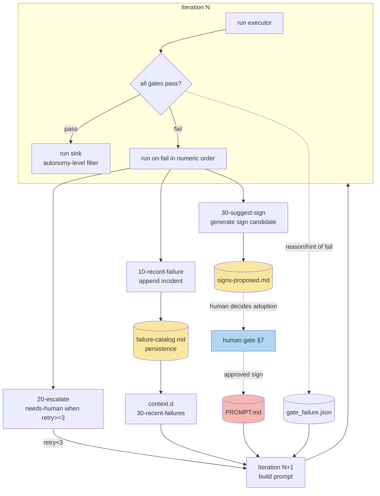

# Detailed Design 03: gate / sink / on-fail

> **Updated to follow v1.8 (reflecting the migration of the core to TS and the removal of `specs/`)**. Per v1.8 §11.1, loop-audit now has **7 items** (previously 6). ① `spec_refs` is now checked by **querying node existence in the knowledge graph** rather than by `test -f` against `specs/` files, and ⑦ **graph-hash verification** has been added. The authoritative table is in [D4 Security Design §4](./d4-security-design.md); §2 of this document follows it.

| Item | Content |
|---|---|
| Target ports | ④ gate / ⑤ sink / ⑥ on-fail |
| Source | [HALO Requirements Definition](../../../docs/HALO要件定義書.md) §4.2④⑤⑥, §7, §11, [ADR-0004](../adr/0004-self-modification-prohibition.md), [ADR-0006](../adr/0006-autonomy-levels.md) |
| Related ADRs | [ADR-0001 Ports & Adapters / Unified Contract](../adr/0001-ports-and-adapters-unified-contract.md), [ADR-0002 Disposable worktree](../adr/0002-disposable-worktree.md) |
| Status | Detailed design |

This document details the design of three ports: the pass/fail judgment of artifacts (gate), the side effects after passing (sink), and the handling of failures (on-fail). These three ports make up the latter half of the core loop, and in the core loop pseudocode of Requirements §4.3 they are driven in the order `run_ports_all gate` → `run_ports_each sink` / re-injection of `last_gate_failure` → on-fail. All plugins follow the unified contract (JSON over stdin/stdout + exit codes, ADR-0001).

---

## 1. gate port (pass/fail judgment)

### 1.1 Contract and numbered-order execution of gate.d

Based on Requirements §4.2④, the input/output of gate plugins is defined as follows.

```
input(stdin): {"task_id": "T-012", "workdir": "/home/user/wt/issue-12", "changed_files": ["src/order.ts", "src/order.test.ts"]}
decision: exit 0 = pass / exit 2 = fail (same convention as Claude Code hooks)
output(fail only, stdout): {"gate": "50-loop-audit", "reason": "diff 1720 lines > 1500", "hint": "Split the Issue into subtasks"}
```

- The core runs all files under `ports/gate.d/` in **ascending order of their numeric prefix**. The numeric order follows the principle of "cheap gates first, expensive gates later" (fail early to save cost). The initial ordering is as in Requirements §8: `10-typecheck` → `20-lint` → `30-test` → `40-ai-review` → `50-loop-audit`.
- **exit 2 convention**: Pass/fail is expressed by the exit code. `exit 0` = pass, `exit 2` = fail. Any other code (1, 127, etc.) is treated as an execution error of the plugin itself, and the core makes it a target of on-fail (storing "gate execution error" in `reason`). Only exit 2 means "the artifact does not meet the criteria." This binary convention is identical to Claude Code's hooks (PreToolUse/Stop), so a gate plugin can be reused as-is as a hook.
- **Full execution vs. early termination**: As a rule, the core runs gate.d all the way to the end and collects the reasons of all failed gates (so that multiple corrective points can be returned to the AI in a single round). However, to handle cases where running a later gate (especially the costly `40-ai-review`) is pointless while an earlier one has failed, it is a design constraint that each gate must be able to judge independently, ignoring earlier fail information (no dependencies between gates). As an operational cost optimization, the core offers an option (the `GATE_FAIL_FAST` environment variable) to select early termination of "skip `40-ai-review` if any gate has failed," but the default is full execution.

### 1.2 fail-time JSON specification (reason / hint)

A failed gate outputs a single JSON object to stdout.

| Field | Type | Required | Meaning |
|---|---|---|---|
| `gate` | string | Required | File name of the gate that fired (including the number, e.g. `30-test`) |
| `reason` | string | Required | The failure fact, leaning machine-readable. Include numbers (e.g. `coverage 87% < 90%`). This is the core content re-injected into the next iteration's prompt |
| `hint` | string | Optional | Direction for correction (e.g. `insufficient tests for src/order.ts`). A hint, not a command. Does not overly constrain the AI's autonomous judgment |
| `evidence` | string[] | Optional | Basis for the judgment (spec-line quotes, failing test names, error-log excerpts). Effectively required for `40-ai-review` due to the evidence requirement described below |

- The core aggregates the JSON of all failed gates into an array and persists it to `gate_failure.json`. In Requirements §4.3, `last_gate_failure=$(cat gate_failure.json)` reads this, and `build_prompt` in the next round re-injects it into the prompt as the "previous gate rejection" block.
- The re-injection format presents `reason` primarily and `hint` secondarily, aiming to keep the AI from "repeating the same failure." `evidence` is attached as primary information for the AI to pinpoint the location to fix.

### 1.3 Initial composition of gate.d and delegation to runtime

| File | Type | Substance |
|---|---|---|
| `10-typecheck.sh` | runtime delegation | A thin wrapper delegating to the adopted runtime's `check.sh` (the type-check portion) |
| `20-lint.sh` | runtime delegation | Delegates to the adopted runtime's `check.sh` (the lint portion) |
| `30-test.sh` | runtime delegation | Delegates to the adopted runtime's `test.sh` (propagating exit 2 = fail as-is) |
| `40-ai-review.sh` | evaluator gate | An evaluation agent with an independent context (§3) |
| `50-loop-audit.sh` | static check | 7-item check based on git diff (§2). Required from day one as a safety invariant |

`10` through `30` hold no actual commands; they delegate to the runtime's `check.sh`/`test.sh` resolved by `.harness.yml` (Requirements §4.2⑦). The gate side does not know "which language" is in use.

---

## 2. The 7-item static check of loop-audit (50-loop-audit)

Based on Requirements §11.1 and ADR-0004. loop-audit is a **safety invariant** and must exist **before** the first unattended run (required from day one of Phase 1). All judgments are performed by **git-diff-based static checks**, without interpreting the AI's intent or the meaning of its output (it must be deterministic).

> **Authority for the item count (v1.8)**: v1.8 §11.1 is authoritative, and the correct count is **7 items** (this table is authoritative). The authoritative table is in [D4 §4](./d4-security-design.md), and this document is aligned to it. There are two differences from the v1.5 line (6 items, premised on `specs/`): ① the way `spec_refs` existence is checked changed from "`test -f specs/*.md`" to "**querying node existence in the knowledge graph**" (removal of `specs/`, ADR-0011), and ⑦ **"the graph file's hash matches the value at loop start" was added** (detecting graph tampering during execution).

### 2.1 Input to the check

```
input: {"task_id": "...", "workdir": "/home/user/wt/issue-N", "changed_files": [...]}
```

Internally it obtains `git -C <workdir> diff --numstat` and `git -C <workdir> diff <base>...HEAD`, and checks the following 7 items in order. If even one item is violated, `exit 2`.

### 2.2 Check methods for the 7 items

| # | Check item | Check method | Example fail reason |
|---|---|---|---|
| ① | **spec_refs existence** | Query whether the task's `spec_refs` (`kg://` node IDs) **exist in the knowledge graph** (read-only). Fail if any referenced node does not exist. * The v1.5 `test -f specs/*.md` is abolished (removal of `specs/`, ADR-0011) | `spec_refs 'kg://...' does not exist in the graph` |
| ② | **Test files unchanged** | Match the diff's changed paths against test-detection patterns (`*.test.*` / `*_test.*` / `test_*.py` / `tests/**`, etc.). Fail if there is even one **deletion or modification** of a test file (adding new tests is allowed) | `test file src/order.test.ts was modified` |
| ③ | **Zero new escape hatches** | grep the diff's **added lines** (`+` lines) to check that no `eslint-disable` / `as any` / `@ts-ignore` newly appears. Keeping existing lines is allowed; additions are forced to zero | `new @ts-ignore added to src/api.ts` |
| ④ | **Coverage thresholds unchanged** | Check whether the coverage-threshold numbers in config files (the coverage sections of `vitest.config.*` / `jest.config.*` / `pyproject.toml`, etc.) have been lowered in the diff | `coverage threshold altered from 90 → 80` |
| ⑤ | **Self-modification prohibited** | Fail if the diff's changed targets include `CLAUDE.md` / `PROMPT.md` / `.harness.yml` / test files (ADR-0004). Definitively blocks the agent from rewriting the targets that constrain the rules | `self-modification of PROMPT.md detected` |
| ⑥ | **diff 1500-line cap** | Fail if the total of added + deleted lines from `git diff --numstat` exceeds 1500. Forces task splitting | `diff 1720 lines > 1500. Split the task` |
| ⑦ | **Graph tampering detection** | Verify that the graph file's hash **matches the value at loop start**. Detects direct tampering during execution as a fail (D4 §5.3; immutability is guaranteed not by git-managing the file but by graph write control) | `graph file was modified during the loop run` |

- ② and ⑤ overlap regarding test files, but ② protects "modifications to tests in general" while ⑤ protects a different invariant, "self-modification (the harness's rule set)." Keeping both independently means one compensates for a check gap in the other.
- The escape-hatch check in ③ targets **new additions only** (limited to the added lines of `git diff` so that an existing suppression comment merely moving lines during a refactor does not fail).
- The 1500 lines in ⑥ is the fixed value from Requirements §11.1. The coverage thresholds (the 90% etc. of ④) are the initial (tentative) values of §11.2 and subject to operational tuning, but the invariant itself of "prohibiting changes that **lower** a threshold" is fixed.
- ① and ⑦ are checks concerning the knowledge graph. In v1.8, which has no `specs/` directory, the reference integrity of freeze requirements (①) and the runtime immutability (⑦) are checked against the graph (D4 §5).

### 2.3 Relationship with dogfooding

As stated in ADR-0004, even after dogfooding is introduced, changes to the harness itself are permanently capped at autonomy level **L2** (human approval required). Item ⑤ of loop-audit is the implementation that definitively blocks this constraint at the gate layer, structurally prohibiting the identification of "the subject that rewrites the rules" with "the subject that is constrained."

---

## 3. Skepticism policy of the evaluator gate (40-ai-review)

Based on Requirements §4.2④ and §11.2. By the Generator/Evaluator separation principle (§3.2 Principle 5), the evaluator is an AI review gate that operates with an **independent context and independent definition** (`project/.claude/agents/evaluator.md`), separate from the implementation agent.

### 3.1 Basic skepticism policy

- Judge on a **3-level severity** scale, and let **only Critical / Major be `exit 2`** (fail). Minor (style, preference) may be noted, but the gate is allowed to pass.
- **Evidence-forcing**: An observation that blocks (makes it a fail) is **required** to present one of the following.
  - A spec-line quote (include the relevant line of `spec_refs` in `evidence`)
  - A concrete failure scenario (a reproduction path of "with this input, this incorrect output")
- **Prohibition of style comments**: Naming preferences, formatting, and subjective "better ways to write it" are not grounds for a fail (those are the domain of lint/formatter).
- The goal is to capture only correctness / requirements-fulfillment gaps and to **prevent over-reporting (false positives)**. Strike a balance so that it behaves skeptically while not halting the unattended loop over evidence-less observations.

### 3.2 Severity judgment criteria

| severity | Definition | Gate behavior |
|---|---|---|
| Critical | Does not meet requirements / data corruption, security defect, spec violation | `exit 2` (fail, rejected) |
| Major | A bug affecting correctness, an overlooked boundary condition, divergence from spec | `exit 2` (fail, rejected) |
| Minor | Style, minor readability, future improvement suggestions | pass (not recorded in `reason`; kept as a reference comment in the PR body) |

### 3.3 Output

On fail, follow the JSON of §1.2, always storing a spec quote or failure scenario in `evidence`.

```json
{
  "gate": "40-ai-review",
  "reason": "Major: validation missing when the order quantity is negative",
  "hint": "Add a quantity > 0 guard to createOrder in src/order.ts",
  "evidence": ["kg://order (domain-term node) 'quantity must be 1 or more'", "with input {quantity:-1}, no exception is raised and an order is created"]
}
```

The skepticism parameters (the tolerance for false positives/negatives) are, per §11.2, **initially only a policy** with no numbers set, and are continuously tuned after real measurements as the `evaluator.md` prompt file. The evaluator is first introduced in Phase 3 (in Phases 1-2 the gates are runtime delegation + loop-audit only).

---

## 4. sink port (side effects after passing) and the autonomy filter

Based on Requirements §4.2⑤ and ADR-0006.

### 4.1 Contract

```
input(stdin): {"task_id": "T-012", "workdir": "/home/user/wt/issue-12", "summary": "Add order validation", "pr_url": null}
output: none (the side effect is the point). exit 0 = success
```

- Runs **only after all gates pass**.
- **Tolerance for partial failure**: Even if one sink fails, the other sinks continue (`run_ports_each` calls each sink independently). Even if commit succeeds but PR creation fails, progress-log is still recorded. No dependencies between sinks.
- Execution is in numeric order (`10` → `15` → `20` → `35`). A later stage (`15-create-pr`) presupposes the artifact of an earlier stage (`10-git-commit`) (the commit), but this is an implicit ordering dependency mediated by branch state, not a data handoff via JSON.

### 4.2 `# min-autonomy:` metadata specification

Each sink declares the **minimum required autonomy level** in a comment line at the top of the file.

```bash
#!/usr/bin/env bash
# min-autonomy: L3
```

- The core (`packages/core`) extracts the value of `# min-autonomy:` from the leading comment of each sink and compares it with the current runtime parameter `AUTONOMY`. **A sink whose `AUTONOMY` is below the declared value is skipped**.
- A sink with no declaration is conservatively treated as the highest level (equivalent to L3) (so that side effects do not accidentally run at a low autonomy level).
- The comparison is done in the order L1 < L2 < L3. When a single sink has multiple modes (the draft/normal of `15-create-pr`), the sink reads `AUTONOMY` internally and branches its behavior (the metadata is the "lower bound for enabling," the internal branch is the "mode selection").

### 4.3 sink correspondence table by autonomy level

Based on the directory structure of Requirements §4.2⑤ and §8, the correspondence of which sinks are enabled at L1/L2/L3.

| sink file | min-autonomy | L1 (report only) | L2 (assisted) | L3 (unattended) | Role |
|---|---|:---:|:---:|:---:|---|
| `20-progress-log.sh` | L1 | Enabled | Enabled | Enabled | Structured recording of progress to `logs/` (record only, no side effects) |
| `10-git-commit.sh` | L2 | Skipped | Enabled | Enabled | Commit to the worktree branch |
| `15-create-pr.sh` | L2(draft)/L3 | Skipped | Enabled (**draft PR**) | Enabled (**normal PR**) | `gh pr create`, with `Closes #<number>` in the body |
| `35-reindex-knowledge.sh` | L3 | Skipped | Skipped | Enabled | Re-index the knowledge graph after docs are merged |

- **L1**: Only `20-progress-log.sh`. No code changes are left as artifacts; only reports of the plan and execution results are left in `logs/`. Used for observation runs immediately after starting a new loop or introducing a new plugin (§3.2 Principle 6, ADR-0006). A human grades this report each night, using it as measured data for promotion decisions.
- **L2**: Up to commit + **draft** PR. A branch and draft PR are prepared in a state awaiting human approval. `15-create-pr.sh` branches to `gh pr create --draft` when `AUTONOMY=L2`.
- **L3**: Unattended up to normal PR creation. `15-create-pr.sh` creates a normal PR without the draft flag when `AUTONOMY=L3`. For docs-type tasks, `35-reindex-knowledge.sh` additionally runs, updating the knowledge graph and reflecting it into the context of subsequent code tasks (bidirectional docs→code reflection, Requirements §4.2⑧).
- **Demotion**: A single serious incident (self-modification detected, sensitive-access attempt) immediately drops to L1 (§11.2). Since the filter is controlled by the single `AUTONOMY` variable, demotion is completed by changing only an environment variable (ADR-0006).

---

## 5. on-fail port (failure handling) and the failure-learning loop

Based on Requirements §4.2⑥.

### 5.1 Contract

```
input(stdin): {"task_id": "T-012", "reason": "coverage 87% < 90%", "retry_count": 2, "gate": "30-test", "workdir": "/home/user/wt/issue-12"}
output: none (the recording, escalation, and suggestion are the point)
```

- Firing conditions: **gate fail** or **executor stuck/timeout**. All plugins are run in numeric order (`10` → `20` → `30`).
- Each plugin has independent side effects and tolerates partial failure.

### 5.2 Specification of the 3 plugins

#### 10-record-failure.sh (failure recording)

```
input: the contract above
side effect: appends to .halo/failure-catalog.md in incident format
```

Appends one entry to `failure-catalog.md` in the following incident format.

| Item | Content |
|---|---|
| Timestamp | Time of appending (ISO 8601) |
| Task | `task_id` |
| Failed gate | `gate` (e.g. `30-test`). If executor-derived, `executor:timeout` etc. |
| Reason | `reason` (the gate's fail JSON as-is) |
| Action | Initially blank (filled in later by a human or the subsequent suggest-sign) |

This catalog becomes the persistence layer of the failure-learning loop (Requirements §3.2 Principle 7).

#### 20-escalate.sh (escalation)

```
input: the contract above
side effect: when retry_count reaches the threshold (3 times, tentative), adds needs-human via task-source and clears in-progress
```

- When `retry_count` reaches the threshold (**3 times**, the tentative initial value of §11.2), it calls the task-source `fail` op, adds the `needs-human` label to the Issue, and removes `in-progress` (breaking the infinite loop).
- If below the threshold, does nothing (retries in the next iteration via reason re-injection).
- The rationale for a threshold of 3 is a heuristic (the 1st time is fixed by reason injection; failing 3 times with the same approach means the approach itself is wrong). The success rate by number of retries is recorded to `logs/` and tuned by measurement (§11.2).

#### 30-suggest-sign.sh (sign candidate generation)

```
input: the contract above (+ references the recent history in failure-catalog.md)
side effect: writes sign candidates for PROMPT.md to signs-proposed.md (adoption is a human decision)
```

- Generates **sign candidates** (permanent instructions of "next time, do this") that should be appended to PROMPT.md from the failure log, and outputs them to `signs-proposed.md`.
- **Adoption is a human decision**. It does not directly append to PROMPT.md (because doing so would conflict with the self-modification prohibition of ADR-0004; sign adoption is a human gate, Requirements §7).
- Full operation begins in Phase 2 (Requirements §9).

### 5.3 Data-flow diagram of the failure-learning loop

A closed loop of failure → record → sign candidate → context re-injection. It diagrams the learning path of "failure → record → re-injection" from Requirements §3.2 Principle 7 and §4.2⑥. `30-recent-failures.sh` of context.d (detailed in the context port of Design 02) reads `failure-catalog.md` and injects it into the next iteration's prompt, closing the loop.



- Solid lines are automatic flows; dotted lines are flows that pass through a human gate. `failure-catalog.md` → context re-injection closes automatically, but `signs-proposed.md` → `PROMPT.md` always goes through a human adoption decision (self-modification prohibition, ADR-0004).
- The `reason`/`hint` of a gate fail is a short-term loop that is **re-injected immediately into the next iteration** via `gate_failure.json`, while `failure-catalog.md` is a long-term loop that **accumulates past failure patterns** — a two-tier structure.

---

## 6. Boundary with the human gate (§7)

The 6 items of Requirements §7 are outside the scope of automation and are always performed by humans. This section organizes where the three ports (gate/sink/on-fail) connect to, or stop at, the human gate.

| # | Human-gate item (§7) | Boundary with the three ports |
|---|---|---|
| 1 | Requirements definition (correctness of the spec) | The gate checks the **existence** of spec_refs (loop-audit ①) and **divergence** from the spec (evaluator), but not the **correctness** of the spec itself. The validity of the spec is the human's domain |
| 2 | Filing the Issue and adding `ready` | The entrance of task-source. Upstream of gate/sink/on-fail. The decision to enqueue into the execution queue is the human's |
| 3 | PR review and merge | The sink (`15-create-pr`) goes only up to PR **creation**. **Merge is not automated** (Requirements §6.1 safe outputs). Even at L3, PR creation is the ceiling, and merge is a human gate |
| 4 | Production deployment approval | Outside the scope of all ports |
| 5 | External API connections / implementations handling sensitive information | The gate checks it, but the implementation task itself is a human gate (sensitive access is blocked by a PreToolUse hook, §6.1) |
| 6 | `needs-human` escalation handling | on-fail (`20-escalate`) is the **exit** that adds `needs-human`. Subsequent handling is the human's. The decision to adopt a sign (`30-suggest-sign` → `signs-proposed.md`) is also a human gate |

- **Design boundary principle**: The three ports make automatic judgments only within the range of "verifiable outputs (tests, builds, diffs, spec existence)," and always hand "correctness, approval, merge, deployment" to humans. The point where the sink's autonomy filter (§4.3) is capped at PR **creation** even at L3, not crossing merge (§7-3), is the intersection of the authority axis (autonomy) and the human gate (a fixed boundary).
- The human gate for sign adoption (included in §7-6) is two sides of the same coin as ADR-0004's self-modification prohibition, blocking, via human approval, the path by which an improvement suggestion generated by on-fail could self-rewrite the loop.

---

## Satisfaction of acceptance criteria

- **Input/output specification of each plugin**: The input JSON, exit codes, and side effects of gate (§1.1-1.2), sink (§4.1-4.2), and on-fail (§5.1-5.2) are defined.
- **sink correspondence table by autonomy level**: §4.3 presents an enabled/skipped table of L1/L2/L3 × each sink.
- **Data-flow diagram of the failure-learning loop**: §5.3 presents a Mermaid diagram (the closed loop of failure → record → sign candidate → context re-injection).
