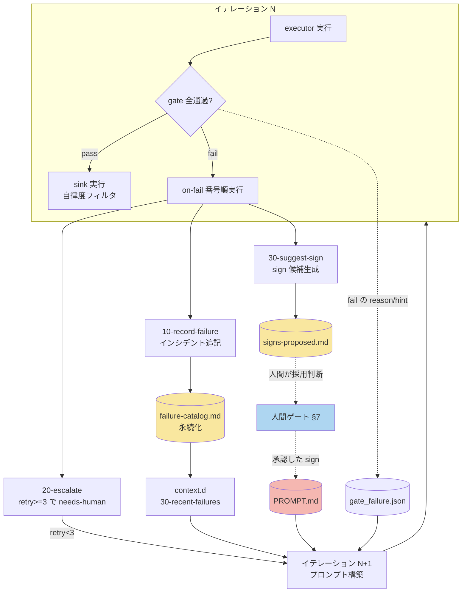

# 詳細設計書 03: gate / sink / on-fail

> **v1.8 追随改訂済み（コア TS 化・specs/ 廃止を反映）**。loop-audit は v1.8 §11.1 に従い **7 項目**（旧 6 項目）。①spec_refs は `specs/` ファイルの `test -f` ではなく**ナレッジグラフのノード実在照会**へ、⑦**グラフハッシュ照合**を追加。権威表は [D4 セキュリティ設計書 §4](./d4-security-design.md) にあり、本書 §2 はそれに追随する。

| 項目 | 内容 |
|---|---|
| 対象ポート | ④ gate / ⑤ sink / ⑥ on-fail |
| 典拠 | [HALO要件定義書](../../HALO要件定義書.md) §4.2④⑤⑥・§7・§11、[ADR-0004](../adr/0004-self-modification-prohibition.md)、[ADR-0006](../adr/0006-autonomy-levels.md) |
| 関連ADR | [ADR-0001 ポート＆アダプタ／統一コントラクト](../adr/0001-ports-and-adapters-unified-contract.md)、[ADR-0002 使い捨てworktree](../adr/0002-disposable-worktree.md) |
| ステータス | 詳細設計 |

本書は成果物の合否判定（gate）・合格後の副作用（sink）・失敗時処理（on-fail）の3ポートを詳細設計する。3ポートはコアループの後半を構成し、要件定義書 §4.3 のコアループ擬似コードにおける `run_ports_all gate` → `run_ports_each sink` / `last_gate_failure` 再注入 → on-fail の順で駆動される。すべてのプラグインは統一コントラクト（stdin/stdout の JSON + 終了コード、ADR-0001）に従う。

---

## 1. gate ポート（合否判定）

### 1.1 コントラクトと gate.d 番号順実行

要件定義書 §4.2④ に基づき、gate プラグインの入出力を定める。

```
入力(stdin): {"task_id": "T-012", "workdir": "/home/user/wt/issue-12", "changed_files": ["src/order.ts", "src/order.test.ts"]}
判定: exit 0 = pass / exit 2 = fail（Claude Code hooks と同一規約）
出力(fail時のみ, stdout): {"gate": "50-loop-audit", "reason": "diff 1720 行 > 1500", "hint": "Issue をサブタスクに分割せよ"}
```

- コアは `ports/gate.d/` 配下のファイルを**数字プレフィックスの昇順**で全実行する。番号順は「安いゲートを先に、高いゲートを後に」の原則で並べる（早期 fail でコスト節約）。初期並びは要件定義書 §8 のとおり `10-typecheck` → `20-lint` → `30-test` → `40-ai-review` → `50-loop-audit`。
- **exit 2 規約**: 合否は終了コードで表現する。`exit 0`=pass、`exit 2`=fail。それ以外（1 や 127 等）はプラグイン自体の実行エラーとして扱い、コアは on-fail の対象（`reason` に「gate 実行エラー」を格納）とする。exit 2 のみが「成果物が基準を満たさない」を意味する。この二値規約は Claude Code の hooks（PreToolUse/Stop）と同一であり、gate プラグインをそのまま hook としても流用できる。
- **全実行 vs 早期打ち切り**: コアは原則として gate.d を最後まで全実行し、fail した全ゲートの reason を収集する（1周で複数の是正点を AI に返すため）。ただし前段が fail したまま後段（特に高コストな `40-ai-review`）を走らせても無意味な場合に備え、各ゲートは前段 fail 情報を無視して独立に判定できること（ゲート間に依存を持たせない）を設計制約とする。運用上のコスト最適化として「1つでも fail したら `40-ai-review` はスキップ」の早期打ち切りをコアのオプション（環境変数 `GATE_FAIL_FAST`）で選べるようにするが、既定は全実行とする。

### 1.2 fail 時 JSON 仕様（reason / hint）

fail したゲートは stdout に単一の JSON オブジェクトを出力する。

| フィールド | 型 | 必須 | 意味 |
|---|---|---|---|
| `gate` | string | 必須 | 発火したゲートのファイル名（番号込み。例 `30-test`） |
| `reason` | string | 必須 | 機械可読寄りの失敗事実。数値を含める（例 `coverage 87% < 90%`）。次イテレーションのプロンプトに再注入される中核 |
| `hint` | string | 任意 | 是正の方向づけ（例 `src/order.ts のテスト不足`）。命令ではなくヒント。AI の自律判断を過度に縛らない |
| `evidence` | string[] | 任意 | 判定根拠（spec 行の引用・失敗テスト名・エラーログ抜粋）。`40-ai-review` では後述の証拠要求のため実質必須 |

- コアは fail した全ゲートの JSON を配列に集約し `gate_failure.json` に永続化する。要件定義書 §4.3 の `last_gate_failure=$(cat gate_failure.json)` がこれを読み、次周回の `build_prompt` で「前回の gate 差し戻し」ブロックとしてプロンプトへ再注入する。
- 再注入フォーマットは `reason` を主、`hint` を副として提示し、AI に「同じ失敗を繰り返させない」ことを狙う。`evidence` は AI が是正箇所を特定するための一次情報として添付する。

### 1.3 gate.d の初期構成と runtime 委譲

| ファイル | 種別 | 実体 |
|---|---|---|
| `10-typecheck.sh` | runtime 委譲 | 採用 runtime の `check.sh`（型検査部）へ委譲する薄いラッパー |
| `20-lint.sh` | runtime 委譲 | 採用 runtime の `check.sh`（lint 部）へ委譲 |
| `30-test.sh` | runtime 委譲 | 採用 runtime の `test.sh` へ委譲（exit 2 = fail をそのまま伝播） |
| `40-ai-review.sh` | evaluator gate | 独立コンテキストの評価エージェント（§3） |
| `50-loop-audit.sh` | 静的検査 | git diff ベースの7項目検査（§2）。安全不変条件のため初日から必須 |

`10`〜`30` は実コマンドを持たず、`.harness.yml` で解決された runtime の `check.sh`/`test.sh` へ委譲する（要件定義書 §4.2⑦）。gate 側は「どの言語か」を知らない。

---

## 2. loop-audit（50-loop-audit）の7項目静的検査

要件定義書 §11.1 と ADR-0004 に基づく。loop-audit は**安全不変条件**であり、初回の無人実行**前**に存在しなければならない（Phase 1 初日から必須）。判定はすべて **git diff ベースの静的検査**で行い、AI の意図や出力の意味は解釈しない（決定的であること）。

> **項目数の権威（v1.8）**: v1.8 §11.1 が権威であり、正は **7 項目**（本表を正とする）。権威表は [D4 §4](./d4-security-design.md) にあり本書はそれに一致させる。v1.5 系（6 項目・specs/ 前提）からの差分は 2 点: ①spec_refs 実在の検査方式が「`test -f specs/*.md`」から「**ナレッジグラフのノード実在照会**」へ変わった（specs/ 廃止、ADR-0011）、⑦**「グラフファイルのハッシュがループ開始時と一致」を追加**した（実行中のグラフ改変検出）。

### 2.1 検査の入力

```
入力: {"task_id": "...", "workdir": "/home/user/wt/issue-N", "changed_files": [...]}
```

内部的に `git -C <workdir> diff --numstat` および `git -C <workdir> diff <base>...HEAD` を取得し、以下7項目を順に検査する。1項目でも違反があれば `exit 2`。

### 2.2 7項目の検査方式

| # | 検査項目 | 検査方式 | fail 時 reason 例 |
|---|---|---|---|
| ① | **spec_refs 実在** | task の `spec_refs`（`kg://` ノード ID）が**ナレッジグラフに実在**するか照会（read-only）。存在しない参照があれば fail。※ v1.5 の `test -f specs/*.md` は廃止（specs/ 廃止、ADR-0011） | `spec_refs 'kg://...' がグラフに存在しない` |
| ② | **テストファイル不変** | diff の変更対象パスをテスト判定パターン（`*.test.*` / `*_test.*` / `test_*.py` / `tests/**` 等）と照合。テストファイルの**削除・変更**が1件でもあれば fail（新規テスト追加は許可） | `テストファイル src/order.test.ts が変更された` |
| ③ | **エスケープハッチ新規ゼロ** | diff の**追加行**（`+` 行）に `eslint-disable` / `as any` / `@ts-ignore` が新規出現していないか grep。既存行の維持は許可、追加はゼロ強制 | `新規 @ts-ignore が src/api.ts に追加された` |
| ④ | **カバレッジ閾値不変** | 設定ファイル（`vitest.config.*` / `jest.config.*` / `pyproject.toml` の coverage 節等）内のカバレッジ閾値数値が diff で下方変更されていないか検査 | `カバレッジ閾値が 90 → 80 に改変された` |
| ⑤ | **自己改変の禁止** | diff の変更対象に `CLAUDE.md` / `PROMPT.md` / `.harness.yml` / テストファイルが含まれていれば fail（ADR-0004）。ルールを縛る対象をエージェントが書き換えることを確定ブロック | `PROMPT.md への自己改変が検出された` |
| ⑥ | **diff 1500 行上限** | `git diff --numstat` の追加+削除行合計が 1500 を超えたら fail。タスク分割の強制 | `diff 1720 行 > 1500。タスクを分割せよ` |
| ⑦ | **グラフ改変検出** | グラフファイルのハッシュが**ループ開始時と一致**するか照合。実行中の直接改変を fail として検出（D4 §5.3。凍結性の担保はファイルの git 管理ではなくグラフ書込制御による） | `グラフファイルがループ実行中に改変された` |

- ②と⑤はテストファイルに関して重複的だが、②は「テストの改変全般」、⑤は「自己改変（ハーネスのルール類）」という異なる不変条件を守る。両方を独立に保持することで、片方の検査漏れをもう片方が補完する。
- ③のエスケープハッチ検査は**新規追加のみ**を対象とする（既存コードのリファクタで既存の抑制コメントが行移動しただけで fail しないよう、`git diff` の追加行に限定）。
- ⑥の 1500 行は要件定義書 §11.1 の確定値。カバレッジ閾値（④の 90% 等）は §11.2 の初期値（仮）であり運用調整対象だが、「閾値を**下げる方向の改変を禁止**する」という不変条件自体は確定である。
- ①⑦はナレッジグラフに関する検査。specs/ ディレクトリを持たない v1.8 では、凍結要件の参照整合（①）と実行中不変（⑦）をグラフに対して検査する（D4 §5）。

### 2.3 dogfooding との関係

ADR-0004 のとおり、dogfooding 導入後もハーネス自身への変更は恒久的に自律度 **L2 上限**（人間承認必須）とする。loop-audit の⑤はこの制約を gate 層で確定ブロックする実装であり、「ルールを書き換える主体」と「縛られる主体」の同一化を構造的に禁止する。

---

## 3. evaluator gate（40-ai-review）の懐疑度方針

要件定義書 §4.2④・§11.2 に基づく。evaluator は Generator/Evaluator 分離原則（§3.2 原則5）により、実装エージェントとは**独立コンテキスト・独立定義**（`project/.claude/agents/evaluator.md`）で動作する AI レビューゲートである。

### 3.1 懐疑度の基本方針

- **severity 3 段階**で判定し、**Critical / Major のみ `exit 2`**（fail）とする。Minor（スタイル・好み）は指摘してもゲートは通過させる。
- **証拠要求（evidence-forcing）**: block する（fail にする）指摘は、以下いずれかの提示を**必須**とする。
  - spec 行の引用（`spec_refs` の該当行を `evidence` に含める）
  - 具体的な失敗シナリオの提示（この入力でこの不正な出力、という再現筋）
- **スタイル指摘の禁止**: 命名の好み・フォーマット・主観的な「より良い書き方」は fail 事由にしない（それらは lint/formatter の領分）。
- 目的は correctness / 要件充足のギャップのみを捕捉し、**過剰指摘（false positive）を防ぐ**こと。懐疑的に振る舞わせつつ、証拠のない指摘で無人ループを止めないバランスを取る。

### 3.2 severity 判定基準

| severity | 定義 | ゲート挙動 |
|---|---|---|
| Critical | 要件を満たさない／データ破壊・セキュリティ欠陥・仕様違反 | `exit 2`（fail・差し戻し） |
| Major | correctness に影響するバグ・境界条件の見落とし・spec との乖離 | `exit 2`（fail・差し戻し） |
| Minor | スタイル・軽微な可読性・将来の改善提案 | pass（`reason` に記録せず、PR 本文の参考コメントに留める） |

### 3.3 出力

fail 時は §1.2 の JSON に従い、`evidence` へ spec 引用または失敗シナリオを必ず格納する。

```json
{
  "gate": "40-ai-review",
  "reason": "Major: 注文数量が負値のときの検証が欠落",
  "hint": "src/order.ts の createOrder に quantity > 0 のガードを追加",
  "evidence": ["kg://order（ドメイン用語ノード）『数量は 1 以上』", "入力 {quantity:-1} で例外が発生せず注文が作られる"]
}
```

懐疑度パラメータ（false positive/negative の許容度）は §11.2 のとおり**初期値は方針のみ**で数値を置かず、実測後に `evaluator.md` プロンプトファイルとして継続調整する。evaluator は Phase 3 で初投入する（Phase 1-2 では gate は runtime 委譲 + loop-audit のみ）。

---

## 4. sink ポート（合格後の副作用）と自律度フィルタ

要件定義書 §4.2⑤ と ADR-0006 に基づく。

### 4.1 コントラクト

```
入力(stdin): {"task_id": "T-012", "workdir": "/home/user/wt/issue-12", "summary": "注文検証を追加", "pr_url": null}
出力: なし（副作用が本体）。exit 0 = 成功
```

- **gate 全通過後のみ**実行される。
- **部分失敗の許容**: 1つの sink が失敗しても他の sink は続行する（`run_ports_each` は各 sink を独立に呼ぶ）。commit が成功して PR 作成が失敗しても、progress-log は記録される。sink 間に依存を持たせない。
- 実行は番号順（`10` → `15` → `20` → `35`）。後段（`15-create-pr`）は前段（`10-git-commit`）の成果物（commit）を前提とするが、これはブランチ状態を介した暗黙の順序依存であり、JSON でのデータ受け渡しではない。

### 4.2 `# min-autonomy:` メタデータ仕様

各 sink はファイル冒頭のコメント行に**最低必要自律度**を宣言する。

```bash
#!/usr/bin/env bash
# min-autonomy: L3
```

- コア（`packages/core`）は各 sink の先頭コメントから `# min-autonomy:` の値を抽出し、現在の実行時パラメータ `AUTONOMY` と比較する。**`AUTONOMY` が宣言値未満の sink はスキップ**する。
- 宣言が無い sink は保守的に最上位（L3 相当）として扱う（誤って低自律度で副作用が走らないため）。
- 比較は L1 < L2 < L3 の順序で行う。同一 sink に複数モードがある場合（`15-create-pr` の draft/通常）は、sink 内部で `AUTONOMY` を読んで挙動を分岐する（メタデータは「有効化の下限」、内部分岐は「モード選択」）。

### 4.3 自律度別 sink 対応表

要件定義書 §4.2⑤・§8 のディレクトリ構成に基づく、L1/L2/L3 で有効になる sink の対応。

| sink ファイル | min-autonomy | L1（報告のみ） | L2（支援付き） | L3（無人） | 役割 |
|---|---|:---:|:---:|:---:|---|
| `20-progress-log.sh` | L1 | 有効 | 有効 | 有効 | 進捗を `logs/` へ構造化記録（副作用なしの記録のみ） |
| `10-git-commit.sh` | L2 | スキップ | 有効 | 有効 | worktree ブランチへ commit |
| `15-create-pr.sh` | L2(draft)/L3 | スキップ | 有効（**draft PR**） | 有効（**通常 PR**） | `gh pr create`、本文に `Closes #番号` |
| `35-reindex-knowledge.sh` | L3 | スキップ | スキップ | 有効 | docs マージ後のナレッジグラフ再インデックス |

- **L1**: `20-progress-log.sh` のみ。コード変更を成果物として残さず、計画・実行結果の報告だけを `logs/` に残す。新規ループ・新規プラグイン導入直後の観察運転で使う（§3.2 原則6、ADR-0006）。人間が毎晩この報告を採点し、昇格判断の実測データとする。
- **L2**: commit + **draft** PR まで。人間承認を待つ状態でブランチと draft PR が用意される。`15-create-pr.sh` は `AUTONOMY=L2` のとき `gh pr create --draft` で分岐する。
- **L3**: 通常 PR 作成まで無人。`15-create-pr.sh` は `AUTONOMY=L3` で draft フラグなしの通常 PR を作る。docs 系タスクではさらに `35-reindex-knowledge.sh` が走り、ナレッジグラフを更新して以降の code タスクの context に反映する（docs→code の双方向反映、要件定義書 §4.2⑧）。
- **降格**: 重大インシデント（自己改変検出・機密アクセス試行）1件で即 L1（§11.2）。フィルタは `AUTONOMY` 変数1つで制御されるため、降格は環境変数の変更のみで完結する（ADR-0006）。

---

## 5. on-fail ポート（失敗時処理）と失敗学習ループ

要件定義書 §4.2⑥ に基づく。

### 5.1 コントラクト

```
入力(stdin): {"task_id": "T-012", "reason": "coverage 87% < 90%", "retry_count": 2, "gate": "30-test", "workdir": "/home/user/wt/issue-12"}
出力: なし（記録・エスカレーション・提案が本体）
```

- 発火条件: **gate fail** または **executor の stuck/timeout**。番号順（`10` → `20` → `30`）で全プラグインを実行する。
- 各プラグインは独立に副作用を持ち、部分失敗を許容する。

### 5.2 3プラグインの仕様

#### 10-record-failure.sh（失敗記録）

```
入力: 上記コントラクト
副作用: .halo/failure-catalog.md にインシデント形式で追記
```

`failure-catalog.md` へ以下のインシデント形式で1件追記する。

| 項目 | 内容 |
|---|---|
| 日時 | 追記時刻（ISO 8601） |
| タスク | `task_id` |
| 失敗ゲート | `gate`（例 `30-test`）。executor 由来なら `executor:timeout` 等 |
| 理由 | `reason`（gate の fail JSON をそのまま） |
| 対処 | 初期は空欄（人間または後続の suggest-sign が埋める） |

このカタログが失敗学習ループの永続化層（要件定義書 §3.2 原則7）となる。

#### 20-escalate.sh（エスカレーション）

```
入力: 上記コントラクト
副作用: retry_count が閾値(3回・仮)到達時に task-source 経由で needs-human 付与 + in-progress 解除
```

- `retry_count` が閾値（**3回**、§11.2 の初期値・仮）に達したら、task-source の `fail` op を呼び、Issue に `needs-human` ラベル付与と `in-progress` 解除を行う（無限ループ遮断）。
- 閾値未満なら何もしない（次イテレーションで reason 再注入により再挑戦させる）。
- 閾値 3 の根拠は経験則（1回目は reason 注入で直る、3回同一アプローチで fail はアプローチ自体の誤り）。retry 回数別の成功率を `logs/` に記録し実測で調整する（§11.2）。

#### 30-suggest-sign.sh（sign 候補生成）

```
入力: 上記コントラクト（+ failure-catalog.md の直近履歴を参照）
副作用: PROMPT.md への sign 候補を signs-proposed.md に出力（採用は人間判断）
```

- 失敗ログから PROMPT.md へ追記すべき **sign 候補**（「次はこうせよ」という恒久的な指示）を生成し `signs-proposed.md` に出力する。
- **採用は人間が判断**する。PROMPT.md への直接追記はしない（ADR-0004 の自己改変禁止に抵触するため。sign の採用は人間ゲート、要件定義書 §7）。
- Phase 2 で本格運用を開始する（要件定義書 §9）。

### 5.3 失敗学習ループのデータフロー図

失敗 → 記録 → sign 候補 → context 再注入の閉ループ。要件定義書 §3.2 原則7・§4.2⑥ の「失敗 → 記録 → 再注入」の学習経路を図示する。context.d の `30-recent-failures.sh`（設計書02 の context ポートで詳述）が `failure-catalog.md` を読み取り、次イテレーションのプロンプトへ注入することで閉じる。



- 実線は自動フロー、点線は人間ゲートを挟むフロー。`failure-catalog.md` → context 再注入は自動で閉じるが、`signs-proposed.md` → `PROMPT.md` は人間の採用判断を必ず経由する（自己改変禁止、ADR-0004）。
- gate fail の `reason`/`hint` は `gate_failure.json` を介して**次イテレーションに即再注入**される短期ループ、`failure-catalog.md` は**過去の失敗パターンを蓄積**する長期ループの二段構えとなる。

---

## 6. 人間ゲート（§7）との境界

要件定義書 §7 の6項目は自動化対象外で常に人間が実施する。gate/sink/on-fail の3ポートがどこで人間ゲートに接続・停止するかを整理する。

| # | 人間ゲート項目（§7） | 3ポートとの境界 |
|---|---|---|
| 1 | 要件定義（仕様の正しさ） | gate は spec_refs の**実在**（loop-audit ①）と spec との**乖離**（evaluator）を検査するが、spec 自体の**正しさ**は検査しない。仕様の妥当性は人間の領分 |
| 2 | Issue 起票と `ready` 付与 | task-source の入口。gate/sink/on-fail の手前。実行キューへの投入判断は人間 |
| 3 | PR レビューとマージ | sink（`15-create-pr`）は PR **作成**まで。**マージは自動化しない**（要件定義書 §6.1 safe outputs）。L3 でも PR 作成が上限で、マージは人間ゲート |
| 4 | 本番デプロイ承認 | 全ポートの範囲外 |
| 5 | 外部 API 接続・機密情報を扱う実装 | gate は検査するが、当該実装タスク自体は人間ゲート（PreToolUse hook で機密アクセスを遮断、§6.1） |
| 6 | `needs-human` エスカレーション処理 | on-fail（`20-escalate`）が `needs-human` を付与する**出口**。以降の処理は人間。sign 採用（`30-suggest-sign` → `signs-proposed.md`）の判断も人間ゲート |

- **設計上の境界原則**: 3ポートは「検証可能な出力（テスト・ビルド・diff・spec 実在）」の範囲でのみ自動判定し、「正しさ・承認・マージ・デプロイ」は必ず人間へ渡す。sink の自律度フィルタ（§4.3）は L3 でも PR **作成**が上限であり、マージ（§7-3）を越えない設計になっている点が、権限軸（自律度）と人間ゲート（固定境界）の交点である。
- sign 採用の人間ゲート（§7-6 に含まれる）は ADR-0004 の自己改変禁止と表裏一体で、on-fail が生成した改善提案がループを自己書き換えする経路を人間承認で遮断する。

---

## 受入基準の充足

- **各プラグインの入出力仕様**: gate（§1.1-1.2）、sink（§4.1-4.2）、on-fail（§5.1-5.2）の入力 JSON・終了コード・副作用を定義済み。
- **自律度別 sink 対応表**: §4.3 に L1/L2/L3 × 各 sink の有効/スキップ表を掲載。
- **失敗学習ループのデータフロー図**: §5.3 に Mermaid 図（失敗 → 記録 → sign 候補 → context 再注入の閉ループ）を掲載。
