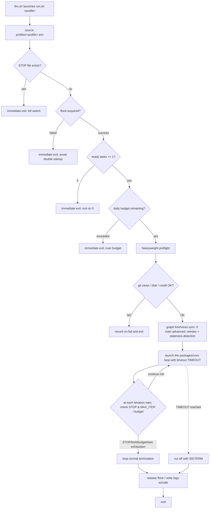

# Detailed Design 04: Startup Layer (trigger / profiles / preflight)

> **Revised to track v1.8 (reflects the migration of the core to TS and the retirement of specs/).** The startup entry point (flock / preflight / STOP / TIMEOUT) is handled by `packages/cli` (`halo run <profile>`, TypeScript). Where this document refers to `bin/run.sh`, it means the role of this CLI entry point. The trigger implementations (`install.sh` / `uninstall.sh` / `fire.sh`) remain bash plugins (the language is free as long as they follow the unified contract).

**Target requirements**: HALO Requirements Specification v1.8 §4.4 (Startup Layer and Scheduling), §8 (Directory Structure)
**Related ADRs**: ADR-0008 (adoption of the polling approach), ADR-0006 (autonomy levels), ADR-0001 (Port & Adapter unified contract), ADR-0010 (migration of the core to TypeScript)
**Positioning**: The "outside" of the core loop = the side that calls the core. Triggers are interchangeable adapters, and the startup entry point (`halo run <profile>` in `packages/cli`, denoted `bin/run.sh <profile>` in this document) is the sole entry point.

---

## 4.1 Overall Structure of the Startup Layer

The startup layer is composed of three layers. Dependencies flow one-way from upper to lower, and the lower layers do not know about the upper ones.

```
[External scheduler]          Windows Task Scheduler (also boots the WSL2 VM)
        │ fires
        ▼
[trigger.d/<name>/fire.sh]  Trigger adapter (schedule / polling / future: webhook / manual)
        │ calls bin/run.sh <profile>
        ▼
[bin/run.sh <profile>]      Startup entry = packages/cli (halo run). flock / 2-stage preflight / STOP / daily budget / TIMEOUT
        │ loads profile env → after preflight passes
        ▼
[packages/core loop]         Core loop (fixed, trigger-independent, TypeScript)
```

**Design principle**: The trigger is the sole entry point that starts run.sh, and everything below run.sh (preflight, loop, ports) does not know what the trigger is (a consequence of ADR-0008). This invariant means that swapping in webhook / manual triggers in the future can be completed with file operations alone.

---

## 4.2 Structure of trigger.d (install / uninstall / fire)

Each trigger holds three scripts under `ports/trigger.d/<name>/`. The three-script structure follows the Port & Adapter principle (ADR-0001), so adding or removing a trigger is completed with directory operations alone.

```
ports/trigger.d/<name>/
├── install.sh   # Register the trigger (scheduler registration, timer enable, etc.)
├── uninstall.sh # Deregister
└── fire.sh      # Actual processing on firing (all commonly call bin/run.sh <profile>)
```

### Responsibilities of Each Script

| Script | Responsibility | Idempotency requirement |
|---|---|---|
| `install.sh` | Register this trigger with an external scheduler (Windows Task Scheduler, etc.). Takes the profile name as an argument and reflects it in the registration name | If a task with the same name already exists, delete → re-register (do not create duplicate registrations) |
| `uninstall.sh` | Deregister the registration created by `install.sh`. If no registration exists, do nothing and exit normally | Deregistering a nonexistent task still exits 0 |
| `fire.sh` | The actual processing fired by the scheduler. Scrubs the PATH (removes inherited Windows paths) and simply calls `bin/run.sh <profile>` | Multiple firings are absorbed by the flock on the run.sh side (fire.sh itself holds no exclusion) |

### Common Implementation Spec for fire.sh (shared by schedule / polling)

`fire.sh` is responsible only for "calling run.sh in the correct environment." It holds no branching by trigger type.

```bash
#!/usr/bin/env bash
set -euo pipefail

HALO_HOME="${HALO_HOME:-$HOME/halo}"
PROFILE="${1:?profile name required}"

# Avoid the Windows PATH inheritance problem: scrub PATH to Linux-side only (addresses the §7 constraint)
export PATH="/usr/local/sbin:/usr/local/bin:/usr/sbin:/usr/bin:/sbin:/bin"

exec "$HALO_HOME/harness/bin/run.sh" "$PROFILE"
```

---

## 4.3 schedule Trigger (primary trigger: Windows Task Scheduler)

**Role**: Because the WSL2 VM stops automatically when idle, a cron / systemd timer inside WSL2 will not fire while the VM is stopped (the rejection reason for alternative 2 in ADR-0008). Therefore, **Windows Task Scheduler is used as the primary trigger**, and its firing also serves to boot the WSL2 VM.

### Example Registration Command for install.sh

The Windows-side `schtasks.exe` is invoked from WSL to register the task. By launching `fire.sh` via `wsl.exe`, task firing = VM boot.

```bash
#!/usr/bin/env bash
set -euo pipefail
PROFILE="${1:?profile required}"          # e.g. nightly
TASK_NAME="HALO_${PROFILE}"
FIRE="/home/$USER/halo/harness/ports/trigger.d/schedule/fire.sh"

# Delete the existing task if any (idempotency)
schtasks.exe /Delete /TN "$TASK_NAME" /F 2>/dev/null || true

# Launch fire.sh <profile> daily at 03:00 via WSL (also boots the VM)
schtasks.exe /Create /TN "$TASK_NAME" \
  /SC DAILY /ST 03:00 \
  /TR "wsl.exe -d Ubuntu -e bash -lc '$FIRE $PROFILE'" \
  /RL LIMITED /F
```

- `/SC DAILY /ST 03:00`: A single late-night launch (for the nightly profile). When driving polling from the Windows side, use `/SC MINUTE /MO 15` (see 4.4).
- `wsl.exe -d Ubuntu -e bash -lc`: Fires via a login shell, and `fire.sh` scrubs the PATH.
- `uninstall.sh` is just `schtasks.exe /Delete /TN "$TASK_NAME" /F`.

### Initial Startup Test (addresses the requirements §Risk Table)

To verify that the nightly trigger does not misfire due to the WSL2 VM auto-stop, the first run validates the startup path with a "dry-run that runs only one iteration late at night (`MAX_ITER=1`)."

---

## 4.4 polling Trigger (high-frequency startup + immediate exit when 0 ready tasks)

**Role**: By combining 15-minute high-frequency startup with the lightweight preflight's "exit immediately if 0 ready tasks" (4.6), it achieves **effectively task-existence-driven** operation without a public endpoint (the core of ADR-0008). By not adopting webhooks, no path is created from public input to local execution.

### Example Registration Command for install.sh

To make polling robust against VM stops as well, the primary trigger is Windows Task Scheduler, fired at 15-minute intervals.

```bash
#!/usr/bin/env bash
set -euo pipefail
PROFILE="${1:?profile required}"          # e.g. continuous
TASK_NAME="HALO_${PROFILE}"
FIRE="/home/$USER/halo/harness/ports/trigger.d/polling/fire.sh"

schtasks.exe /Delete /TN "$TASK_NAME" /F 2>/dev/null || true

# Launch at 15-minute intervals (also boots the VM). For daytime-only, narrow the window with /ST//ET
schtasks.exe /Create /TN "$TASK_NAME" \
  /SC MINUTE /MO 15 \
  /TR "wsl.exe -d Ubuntu -e bash -lc '$FIRE $PROFILE'" \
  /RL LIMITED /F
```

- A "daytime-only" window like **daytime-l1** is narrowed by specifying start/end times on the Task Scheduler side (e.g., a trigger setting equivalent to `/SC MINUTE /MO 15 /ST 09:00 /ET 18:00`).
- Overlap between the 15-minute interval and the actual iteration runtime is absorbed by run.sh's `flock` (4.7). If an iteration longer than the polling interval is running, subsequent firings are immediately rejected by the exclusion lock and no double startup occurs.

### Significance of the Immediate Exit on 0 Tasks

Most firings end with "0 ready tasks" at the lightweight preflight stage (a few seconds). Because the heavyweight preflight (git clean / disk / credit probe / graph sync) and the core loop run only when a task actually exists, wasted cost is minimized even with high-frequency startup.

---

## 4.5 Profile (profiles/*.env) Environment Variable Definitions

A profile bundles a combination of "frequency × autonomy × budget" as an environment variable file. Triggers merely specify a profile name and call `bin/run.sh <profile>`, and all execution settings are consolidated here. `AUTONOMY` is interpreted by the sink filter in ADR-0006.

### Environment Variable Table for the Three Profiles

| Environment variable | continuous.env | daytime-l1.env | nightly.env | Meaning |
|---|---|---|---|---|
| `PROFILE_NAME` | `continuous` | `daytime-l1` | `nightly` | Profile identifier name (used for logs and lock names) |
| `AUTONOMY` | `L3` | `L1` | `L3` | Autonomy level. L1 = report only / L2 = commit + draft PR / L3 = unattended through PR creation (ADR-0006) |
| `TRIGGER` | `polling` | `polling` | `schedule` | Corresponding trigger type (makes the install target explicit. Metadata that run.sh does not reference) |
| `MAX_ITER` | `20` | `3` | `50` | Upper limit on the maximum number of iterations run in a single startup |
| `TIMEOUT` | `3h` | `1h` | `8h` | Runtime limit for a single startup. Cut off when exceeded (4.7) |
| `DAILY_MAX_ITERATIONS` | `60` | `12` | `50` | Daily iteration budget. Exit immediately if the day's actuals in logs/ exceed it (4.7) |
| `POLL_WINDOW` | `24h` (all day) | `09:00-18:00` (daytime) | `-` (schedule-dependent) | Polling operating window. Firings outside the window exit immediately at the lightweight preflight |
| `TASK_FILTER` | `is:open label:ready` | `is:open label:ready` | `is:open label:ready,batch` | Issue filter that the task-source picks up |
| `KIND_FILTER` | `code,docs` | `code,docs` | `code,docs,graph-rebuild` | Target task kinds to process (nightly includes larger batches) |

> Note: The numeric values in the table (MAX_ITER, TIMEOUT, DAILY_MAX_ITERATIONS) are initial values and will be adjusted based on Phase 2 measurements (scoring over 10 nights). The requirements specify only the existence of the three types—"continuous = L3/polling 15 min," "daytime-l1 = L1/polling daytime," "nightly = L3/schedule once late at night"—and each axis (AUTONOMY, MAX_ITER, TIMEOUT, budget); the concrete values are subject to operational tuning.

### Example env File (continuous.env)

```bash
# profiles/continuous.env — the primary: continuous, task-existence-driven consumption
export PROFILE_NAME=continuous
export AUTONOMY=L3
export TRIGGER=polling
export MAX_ITER=20
export TIMEOUT=3h
export DAILY_MAX_ITERATIONS=60
export POLL_WINDOW=24h
export TASK_FILTER="is:open label:ready"
export KIND_FILTER=code,docs
```

---

## 4.6 Two-Stage Preflight (lightweight / heavyweight)

To reconcile high-frequency startup with heavy inspection, the preflight is split into lightweight/heavyweight stages. **The lightweight stage runs every time in a few seconds**, and **the heavyweight stage runs only when a task actually exists**. Checks are evaluated top-down, and if any of them meets a cutoff condition, it exits immediately (the rest are not evaluated).

### Lightweight Preflight (every time, a few seconds / evaluation order)

| Order | Check item | Pass condition | Behavior on failure |
|---|---|---|---|
| 1 | STOP file check | `.halo/STOP` does not exist | Exit immediately (kill switch activated) |
| 2 | flock acquisition | The exclusive lock on `$TMPDIR/halo.lock` can be acquired | Exit immediately (a preceding iteration is running = avoid double startup) |
| 3 | ready task presence | The task-source returns at least one ready task | Exit immediately (immediate exit on 0 tasks = the core of polling) |
| 4 | daily budget remaining | The day's actuals in logs/ < `DAILY_MAX_ITERATIONS` | Exit immediately (budget exceeded) |

The lightweight stage does not hit external APIs (it does not include a credit probe) and decides based only on local files/locks/Issue counts, so it finishes in a few seconds. Most polling firings end here.

### Heavyweight Preflight (only when a ready task actually exists / evaluation order)

| Order | Check item | Pass condition | Behavior on failure |
|---|---|---|---|
| 1 | git working tree clean | main is clean (no uncommitted changes) | Record an error and exit (prevents worktree creation in a dirty state) |
| 2 | disk space remaining | Free space is at or above the threshold | Record an error and exit (detects worktree-expansion failure in advance) |
| 3 | credit probe | The remaining API credit is at a runnable level | Record an error and exit (prevents startup in a depleted state) |
| 4 | graph freshness sync | If main has advanced since the last indexing, re-index → staleness detection | Perform re-indexing (Plan A: merge-driven + preflight, §5.1). If staleness is detected, automatically open a `kind:docs` fix Issue |

The graph freshness sync satisfies the constraint that writes to KuzuDB are limited to "only once at preflight time" (the constraint under parallelism in §5.1). Thereafter, the graph during loop execution becomes immutable as a read-only snapshot.

---

## 4.7 run.sh Startup Flow and Safety Mechanisms

### Startup Flowchart (Mermaid)



### Implementation Spec for the Four Safety Mechanisms

| Mechanism | Implementation | Trigger point | Purpose |
|---|---|---|---|
| **flock** | Acquire `flock -n $TMPDIR/halo.lock` non-blockingly at the top of run.sh. Acquisition failure = a preceding run is active, so exit immediately. The lock name can be separated per profile (`$TMPDIR/halo.${PROFILE_NAME}.lock`) | Lightweight preflight order 2 | Prevent double startup. Avoid overlap with iterations longer than the polling interval |
| **STOP file** | Check for the existence of `.halo/STOP`. Checked both at the top of run.sh (at startup) and at the top of each iteration of the core loop, and exits immediately if it exists | Lightweight preflight order 1 + inside the loop | Stop by merely placing a file without entering a terminal (also possible from Windows Explorer) |
| **daily budget** | Uses `DAILY_MAX_ITERATIONS` as the upper limit and computes the day's actuals from logs/ (see next item). Compared at startup and after each iteration; if exceeded, exit/cut off immediately even after startup | Lightweight preflight order 4 + inside the loop | Prevents "it was running all day before I noticed" under high-frequency startup. The primary cost control that replaces TIMEOUT=8h premised on a single nightly run |
| **TIMEOUT** | Wraps the entire `packages/core` loop with `timeout "$TIMEOUT"`. On reaching it, cut off with SIGTERM and perform cleanup (flock release, logs write) | Loop startup time | Consistency with the polling interval, prevention of resource occupation |

### Daily Budget Computation Logic (based on logs/ actuals)

The daily budget does not depend on a fixed counter or external state; it is **computed each time from the day's structured execution logs remaining in logs/**. As a result, even after double startup or a crash, actuals are neither double-counted nor lost (the log is the single source of truth).

- **Definition of actuals**: Count the number of iteration-completion records for the current day (timestamps matching `date +%F`) under `logs/`. Iteration completion is appended one record at a time by the progress-log sink (`20-progress-log.sh`), so that line count is the day's actuals.
- **Computation procedure**:
  1. Obtain `TODAY=$(date +%F)`.
  2. Extract the current day's completion records from `logs/` and obtain the count `USED` (e.g., scan logs partitioned by date, or grep JSON Lines by `TODAY` and count lines).
  3. Compute `REMAINING = DAILY_MAX_ITERATIONS - USED`.
  4. If `REMAINING <= 0`, exit immediately at startup (lightweight preflight order 4).
  5. Inside the loop, recompute after each iteration and cut off at `USED >= DAILY_MAX_ITERATIONS`.
- **Pseudo-implementation of the computation**:

```bash
daily_budget_remaining() {
  local today used
  today=$(date +%F)
  # use the count of the day's completion records in progress-log as the actuals
  used=$(grep -c "\"date\":\"${today}\"" "$HALO_HOME/harness/logs/progress.jsonl" 2>/dev/null || echo 0)
  echo $(( DAILY_MAX_ITERATIONS - used ))
}
# startup-time check
[ "$(daily_budget_remaining)" -le 0 ] && { echo "daily budget exhausted"; exit 0; }
```

- **Design intent**: By unifying budget counting into "reading the actuals log" rather than "a side effect on a separate file," dual state management is avoided (invariant: as long as logs/ is not lost, the budget is correctly reproduced). Since the day's actuals reset to 0 when the date changes, no explicit daily-reset processing is needed.

---

## Chapter Summary

- **4.1** Overall structure of the startup layer (one-way dependency: scheduler → trigger → run.sh → loop)
- **4.2** The install/uninstall/fire three-script structure of trigger.d and the common fire.sh spec
- **4.3** schedule trigger (Windows Task Scheduler + doubling as WSL2 VM boot, schtasks registration example, initial dry-run test)
- **4.4** polling trigger (15-minute-interval schtasks registration example, task-existence-driven operation via immediate exit on 0 ready tasks)
- **4.5** Environment variable definition table and env example for the three profiles (continuous/daytime-l1/nightly)
- **4.6** Check-item and ordering tables for the two-stage lightweight/heavyweight preflight
- **4.7** run.sh startup flowchart (Mermaid), implementation spec for the four safety mechanisms, and the logs/-actuals-based daily budget computation logic
