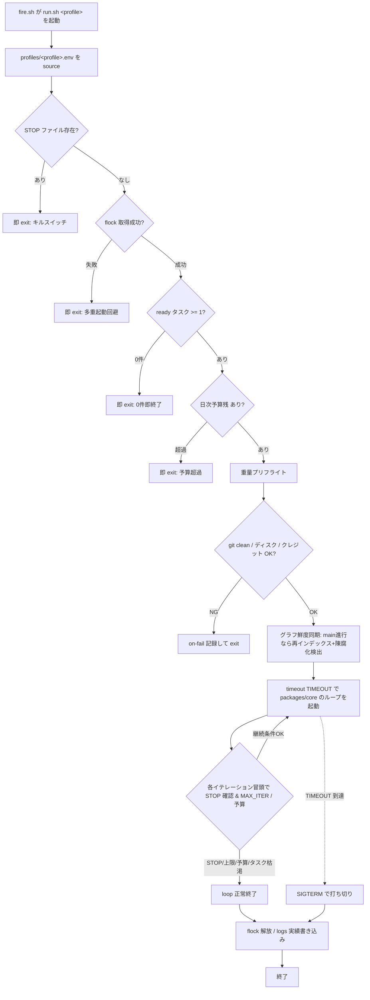

# 詳細設計書 04: 起動層（trigger / プロファイル / プリフライト）

> **v1.8 追随改訂済み（コア TS 化・specs/ 廃止を反映）**。起動エントリ（flock / プリフライト / STOP / TIMEOUT）は `packages/cli`（`halo run <profile>`、TypeScript）が担う。以下で `bin/run.sh` と記す箇所はこの CLI エントリの役割を指す。トリガー実体（`install.sh` / `uninstall.sh` / `fire.sh`）は bash プラグインのまま許容する（統一コントラクトに従う限り言語自由）。

**対象要件**: HALO要件定義書 v1.8 §4.4（起動層とスケジューリング）、§8（ディレクトリ構成）
**関連 ADR**: ADR-0008（ポーリング方式採用）、ADR-0006（自律度レベル）、ADR-0001（ポート＆アダプタ統一コントラクト）、ADR-0010（コア TypeScript 化）
**位置づけ**: コアループの「外側」= コアを呼ぶ側。トリガーは交換可能なアダプタであり、起動エントリ（`packages/cli` の `halo run <profile>`、本書では `bin/run.sh <profile>` と表記）が唯一の入口。

---

## 4.1 起動層の全体構造

起動層は3つの層で構成される。上位から下位へ一方向に依存し、下位は上位を知らない。

```
[外部スケジューラ]          Windows タスクスケジューラ（WSL2 VM 起動を兼ねる）
        │ 発火
        ▼
[trigger.d/<name>/fire.sh]  トリガーアダプタ（schedule / polling / 将来: webhook / manual）
        │ bin/run.sh <profile> を呼ぶ
        ▼
[bin/run.sh <profile>]      起動エントリ = packages/cli（halo run）。flock / 2段プリフライト / STOP / 日次予算 / TIMEOUT
        │ プロファイル env を読み込み → プリフライト通過後
        ▼
[packages/core のループ]     コアループ（固定・トリガー非依存、TypeScript）
```

**設計原則**: trigger は run.sh を起動する唯一の入口であり、run.sh 以下（プリフライト・loop・ポート群）はトリガーが何であるかを知らない（ADR-0008 の帰結）。この不変条件により、将来 webhook / manual への差し替えがファイル操作のみで完結する。

---

## 4.2 trigger.d の構造（install / uninstall / fire）

各トリガーは `ports/trigger.d/<name>/` 配下に3スクリプトを持つ。3スクリプト構造はポート＆アダプタ原則（ADR-0001）に従い、追加・削除はディレクトリ操作のみで完結する。

```
ports/trigger.d/<name>/
├── install.sh   # トリガーの登録（スケジューラ登録・timer 有効化等）
├── uninstall.sh # 登録の解除
└── fire.sh      # 発火時の実処理（共通で bin/run.sh <profile> を呼ぶ）
```

### スクリプトの責務

| スクリプト | 責務 | 冪等性の要件 |
|---|---|---|
| `install.sh` | 外部スケジューラ（Windows タスクスケジューラ等）へ本トリガーを登録する。プロファイル名を引数で受け、登録名に反映する | 同名タスクが既に存在する場合は削除→再登録（重複登録を作らない） |
| `uninstall.sh` | `install.sh` が作成した登録を解除する。登録が無ければ何もせず正常終了 | 存在しないタスクの解除でも exit 0 |
| `fire.sh` | スケジューラから発火される実処理。PATH 洗い直し（Windows パス継承の除去）を行い、`bin/run.sh <profile>` を呼ぶだけ | 多重発火は run.sh 側の flock で吸収する（fire.sh 自身は排他を持たない） |

### fire.sh の共通実装仕様（schedule / polling 共通）

`fire.sh` は「run.sh を正しい環境で呼ぶ」ことだけに責任を持つ。トリガー種別による分岐は持たない。

```bash
#!/usr/bin/env bash
set -euo pipefail

HALO_HOME="${HALO_HOME:-$HOME/halo}"
PROFILE="${1:?profile name required}"

# Windows パス継承問題の回避: PATH を Linux 側のみに洗い直す（§7 制約対応）
export PATH="/usr/local/sbin:/usr/local/bin:/usr/sbin:/usr/bin:/sbin:/bin"

exec "$HALO_HOME/harness/bin/run.sh" "$PROFILE"
```

---

## 4.3 schedule トリガー（一次トリガー: Windows タスクスケジューラ）

**役割**: WSL2 VM は無操作で自動停止するため、WSL2 内の cron / systemd timer は VM 停止中に発火しない（ADR-0008 代替案2 の却下理由）。そこで **Windows タスクスケジューラを一次トリガー**とし、その発火が WSL2 VM の起動を兼ねる。

### install.sh の登録コマンド例

Windows 側の `schtasks.exe` を WSL から呼び出して登録する。`wsl.exe` 経由で `fire.sh` を起動する形にすることで、タスク起動＝VM 起動となる。

```bash
#!/usr/bin/env bash
set -euo pipefail
PROFILE="${1:?profile required}"          # 例: nightly
TASK_NAME="HALO_${PROFILE}"
FIRE="/home/$USER/halo/harness/ports/trigger.d/schedule/fire.sh"

# 既存タスクがあれば削除（冪等化）
schtasks.exe /Delete /TN "$TASK_NAME" /F 2>/dev/null || true

# 毎日 03:00 に WSL 経由で fire.sh <profile> を起動（VM 起動を兼ねる）
schtasks.exe /Create /TN "$TASK_NAME" \
  /SC DAILY /ST 03:00 \
  /TR "wsl.exe -d Ubuntu -e bash -lc '$FIRE $PROFILE'" \
  /RL LIMITED /F
```

- `/SC DAILY /ST 03:00`: 深夜1回起動（nightly プロファイル向け）。polling を Windows 側で駆動する場合は `/SC MINUTE /MO 15` を用いる（4.4 参照）。
- `wsl.exe -d Ubuntu -e bash -lc`: ログインシェル経由で発火し、`fire.sh` が PATH を洗い直す。
- `uninstall.sh` は `schtasks.exe /Delete /TN "$TASK_NAME" /F` のみ。

### 初回の起動テスト（要件 §リスク表対応）

WSL2 VM 自動停止による夜間トリガー不発を確認するため、初回は「深夜に1イテレーションだけ走る dry-run（`MAX_ITER=1`）」で起動経路を検証する。

---

## 4.4 polling トリガー（高頻度起動 + ready タスク0件即終了）

**役割**: 15分間隔の高頻度起動と、軽量プリフライトの「ready タスク0件なら即終了」（4.6）を組み合わせ、公開エンドポイントなしで**実質的なタスク存在駆動**を実現する（ADR-0008 の中核）。webhook を採用しないことで公開入力→ローカル実行の導線を作らない。

### install.sh の登録コマンド例

polling も VM 停止に強くするため一次トリガーは Windows タスクスケジューラとし、15分間隔で発火させる。

```bash
#!/usr/bin/env bash
set -euo pipefail
PROFILE="${1:?profile required}"          # 例: continuous
TASK_NAME="HALO_${PROFILE}"
FIRE="/home/$USER/halo/harness/ports/trigger.d/polling/fire.sh"

schtasks.exe /Delete /TN "$TASK_NAME" /F 2>/dev/null || true

# 15分間隔で起動（VM 起動を兼ねる）。日中限定は /ST//ET で窓を絞る
schtasks.exe /Create /TN "$TASK_NAME" \
  /SC MINUTE /MO 15 \
  /TR "wsl.exe -d Ubuntu -e bash -lc '$FIRE $PROFILE'" \
  /RL LIMITED /F
```

- **daytime-l1** のような「日中のみ」の窓は、タスクスケジューラ側で開始/終了時刻を指定して絞る（例: `/SC MINUTE /MO 15 /ST 09:00 /ET 18:00` 相当のトリガー設定）。
- 15分間隔とイテレーション実時間の重複は run.sh の `flock`（4.7）で吸収する。ポーリング間隔より長いイテレーションが走っていれば、後続の発火は即座に排他で弾かれ二重起動しない。

### 0件即終了の意義

大半の発火は「ready タスク0件」で軽量プリフライト段階（数秒）で終了する。重量プリフライト（git clean / ディスク / クレジット probe / グラフ同期）とコアループはタスクが実在した時のみ実行されるため、高頻度起動でも無駄コストを最小化できる。

---

## 4.5 プロファイル（profiles/*.env）の環境変数定義

プロファイルは「頻度 × 自律度 × 予算」の組み合わせを環境変数ファイルとして束ねたもの。トリガーはプロファイル名を指定して `bin/run.sh <profile>` を呼ぶだけとし、実行設定はすべてここに集約する。`AUTONOMY` は ADR-0006 の sink フィルタで解釈される。

### プロファイル3種の環境変数一覧表

| 環境変数 | continuous.env | daytime-l1.env | nightly.env | 意味 |
|---|---|---|---|---|
| `PROFILE_NAME` | `continuous` | `daytime-l1` | `nightly` | プロファイル識別名（ログ・ロック名に使用） |
| `AUTONOMY` | `L3` | `L1` | `L3` | 自律度。L1=報告のみ / L2=commit+draft PR / L3=PR 作成まで無人（ADR-0006） |
| `TRIGGER` | `polling` | `polling` | `schedule` | 対応トリガー種別（install 対象の明示。run.sh は参照しないメタ情報） |
| `MAX_ITER` | `20` | `3` | `50` | 1回の起動で回す最大イテレーション数の上限 |
| `TIMEOUT` | `3h` | `1h` | `8h` | 1回の起動の実行時間上限。超過で打ち切り（4.7） |
| `DAILY_MAX_ITERATIONS` | `60` | `12` | `50` | 日次イテレーション予算。logs/ 当日実績が超過なら即終了（4.7） |
| `POLL_WINDOW` | `24h`（終日） | `09:00-18:00`（日中） | `-`（schedule 依存） | ポーリング稼働窓。窓外の発火は軽量プリフライトで即終了 |
| `TASK_FILTER` | `is:open label:ready` | `is:open label:ready` | `is:open label:ready,batch` | task-source が拾う Issue フィルタ |
| `KIND_FILTER` | `code,docs` | `code,docs` | `code,docs,graph-rebuild` | 処理対象の task kind（nightly は大きめバッチを含む） |

> 補足: 表の数値（MAX_ITER・TIMEOUT・DAILY_MAX_ITERATIONS）は初期値であり、Phase 2 の実測（10晩分の採点）で調整する。要件は「continuous=L3/polling 15分」「daytime-l1=L1/polling 日中」「nightly=L3/schedule 深夜1回」の3種と各軸（AUTONOMY・MAX_ITER・TIMEOUT・予算）の存在のみを規定し、具体値は運用チューニング対象。

### env ファイルの例（continuous.env）

```bash
# profiles/continuous.env — 本命: タスク存在駆動の常時消化
export PROFILE_NAME=continuous
export AUTONOMY=L3
export TRIGGER=polling
export MAX_ITER=20
export TIMEOUT=3h
export DAILY_MAX_ITERATIONS=60
export POLL_WINDOW=24h
export TASK_FILTER="is:open label:ready"
export KIND_FILTER=code,docs
```

---

## 4.6 2段プリフライト（軽量 / 重量）

高頻度起動と重い検査を両立させるため、プリフライトを軽量/重量に分割する。**軽量は毎回・数秒**、**重量はタスクが実在した時のみ**実行する。判定は上から順に評価し、いずれかで打ち切り条件を満たせば即 exit（後続を評価しない）。

### 軽量プリフライト（毎回・数秒 / 判定順）

| 順 | 判定項目 | 通過条件 | 不通過時の挙動 |
|---|---|---|---|
| 1 | STOP ファイル確認 | `.halo/STOP` が存在しない | 即 exit（キルスイッチ発動） |
| 2 | flock 取得 | `$TMPDIR/halo.lock` の排他ロックを取得できる | 即 exit（先行イテレーション実行中 = 多重起動回避） |
| 3 | ready タスク有無 | task-source が返す ready タスクが1件以上 | 即 exit（0件即終了 = ポーリングの中核） |
| 4 | 日次予算残 | logs/ 当日実績 < `DAILY_MAX_ITERATIONS` | 即 exit（予算超過） |

軽量段は外部 API を叩かず（クレジット probe を含まない）、ローカルのファイル/ロック/Issue 件数のみで判定するため数秒で終わる。大半の polling 発火はここで終了する。

### 重量プリフライト（ready タスクが実在した時のみ / 判定順）

| 順 | 判定項目 | 通過条件 | 不通過時の挙動 |
|---|---|---|---|
| 1 | git 作業ツリー clean | main が clean（未コミット変更なし） | エラー記録して exit（汚染状態での worktree 生成を防ぐ） |
| 2 | ディスク残量 | 空き容量が閾値以上 | エラー記録して exit（worktree 展開不能を事前検出） |
| 3 | クレジット probe | API クレジット残が実行可能水準 | エラー記録して exit（枯渇状態での起動を防ぐ） |
| 4 | グラフ鮮度同期 | main が前回インデックス時から進行していれば再インデックス→陳腐化検出 | 再インデックス実行（案A: マージ駆動 + プリフライト、§5.1）。陳腐化を検出したら `kind:docs` の修正 Issue を自動起票 |

グラフ鮮度同期は KuzuDB への書き込みを「プリフライト時の1回のみ」に限定する制約（§5.1 並列時の制約）を満たす。以降ループ実行中のグラフは read-only スナップショットとして不変になる。

---

## 4.7 run.sh の起動フローと安全装置

### 起動フローチャート（Mermaid）



### 安全装置4種の実装仕様

| 装置 | 実装 | 発火点 | 目的 |
|---|---|---|---|
| **flock** | `flock -n $TMPDIR/halo.lock` を run.sh 冒頭で非ブロッキング取得。取得失敗＝先行実行中で即 exit。ロック名はプロファイル単位（`$TMPDIR/halo.${PROFILE_NAME}.lock`）で分離可能 | 軽量プリフライト順2 | 多重起動防止。ポーリング間隔より長いイテレーションとの重複回避 |
| **STOP ファイル** | `.halo/STOP` の存在確認。run.sh 冒頭（起動時）と、コアループの各イテレーション冒頭の両方で確認し、存在すれば即終了 | 軽量プリフライト順1 + ループ内 | 端末に入らずファイル配置だけで停止（Windows エクスプローラーからも可） |
| **日次予算** | `DAILY_MAX_ITERATIONS` を上限とし、当日実績を logs/ から算出（次項）。起動時と各イテレーション後に照合し、超過なら起動しても即終了/打ち切り | 軽量プリフライト順4 + ループ内 | 高頻度起動での「気づいたら一日中回っていた」を防ぐ。夜間1回前提の TIMEOUT=8h を置き換える主たるコスト制御 |
| **TIMEOUT** | `timeout "$TIMEOUT"` で `packages/core` のループ全体を包む。到達時 SIGTERM で打ち切り、後始末（flock 解放・logs 書き込み）を行う | ループ起動時 | ポーリング間隔との整合、資源占有の防止 |

### 日次予算の算出ロジック（logs/ 実績ベース）

日次予算は固定カウンタや外部状態に依存せず、**logs/ に残る当日の構造化実行ログから都度算出する**。これにより多重起動・クラッシュ後でも実績が二重計上/欠落しない（ログが単一の真実源）。

- **実績の定義**: `logs/` 配下の当日分（`date +%F` に一致するタイムスタンプ）のイテレーション完了レコード件数を数える。イテレーション完了は progress-log sink（`20-progress-log.sh`）が1件ずつ追記するため、その行数が当日実績となる。
- **算出手順**:
  1. `TODAY=$(date +%F)` を取得。
  2. `logs/` から当日分の完了レコードを抽出し件数 `USED` を得る（例: 日付でパーティションされたログを走査、または JSON Lines を `TODAY` で grep して行数カウント）。
  3. `REMAINING = DAILY_MAX_ITERATIONS - USED` を計算。
  4. `REMAINING <= 0` なら起動時点で即 exit（軽量プリフライト順4）。
  5. ループ内では各イテレーション後に再算出し、`USED >= DAILY_MAX_ITERATIONS` で打ち切る。
- **算出の擬似実装**:

```bash
daily_budget_remaining() {
  local today used
  today=$(date +%F)
  # progress-log の当日完了レコード件数を実績とする
  used=$(grep -c "\"date\":\"${today}\"" "$HALO_HOME/harness/logs/progress.jsonl" 2>/dev/null || echo 0)
  echo $(( DAILY_MAX_ITERATIONS - used ))
}
# 起動時判定
[ "$(daily_budget_remaining)" -le 0 ] && { echo "daily budget exhausted"; exit 0; }
```

- **設計意図**: 予算のカウントを「別ファイルの副作用」ではなく「実績ログの読み取り」に一本化することで、状態の二重管理を避ける（不変条件: logs/ が消えない限り予算は正しく再現される）。日をまたげば当日実績が0件に戻るため、日次リセットの明示処理は不要。

---

## 章立て要約

- **4.1** 起動層の全体構造（スケジューラ→trigger→run.sh→loop の一方向依存）
- **4.2** trigger.d の install/uninstall/fire 3スクリプト構造と共通 fire.sh 仕様
- **4.3** schedule トリガー（Windows タスクスケジューラ + WSL2 VM 起動兼用、schtasks 登録例、初回 dry-run テスト）
- **4.4** polling トリガー（15分間隔 schtasks 登録例、ready 0件即終了によるタスク存在駆動）
- **4.5** プロファイル3種（continuous/daytime-l1/nightly）の環境変数定義表と env 例
- **4.6** 軽量/重量2段プリフライトの判定項目・順序表
- **4.7** run.sh 起動フローチャート（Mermaid）、安全装置4種の実装仕様、日次予算の logs/ 実績ベース算出ロジック
